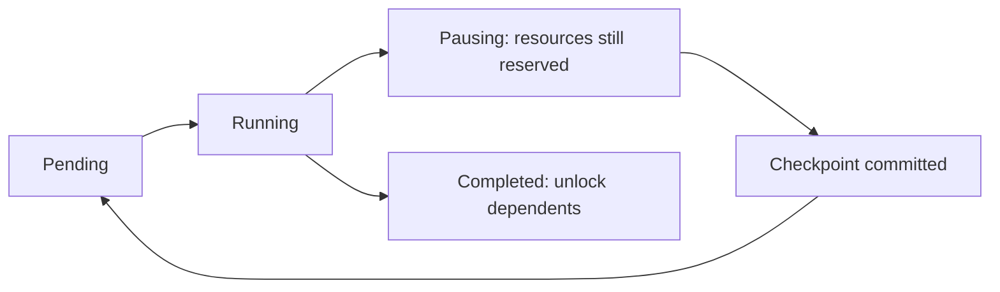
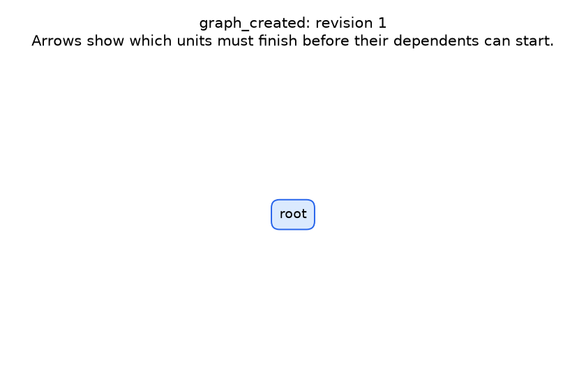
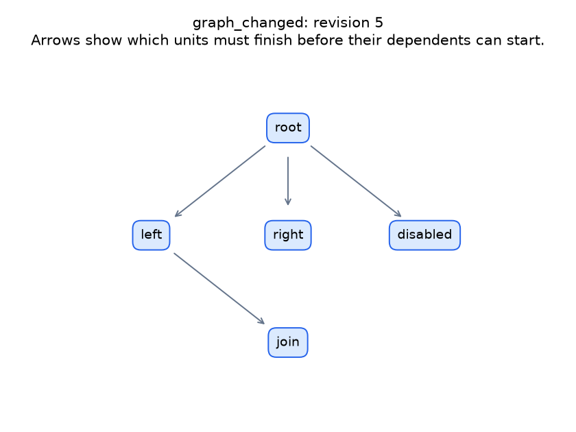
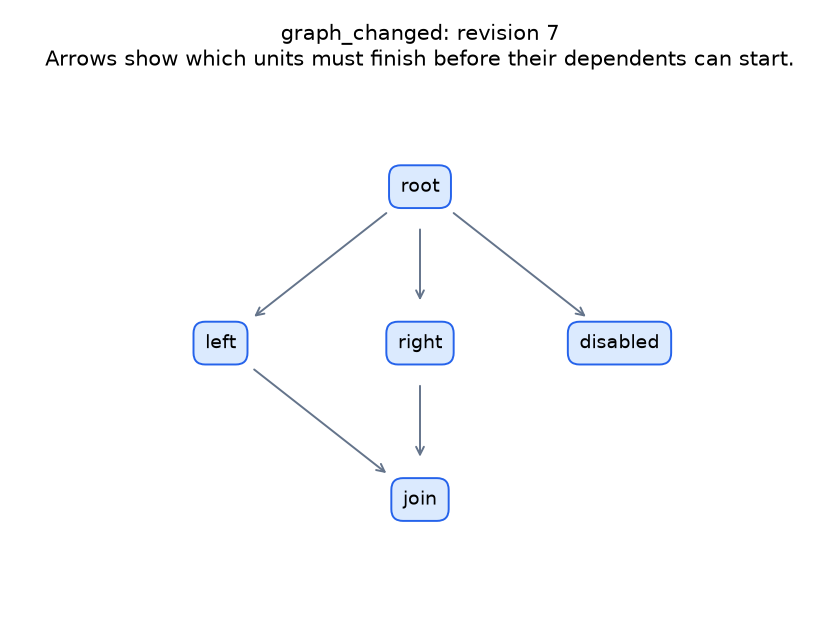
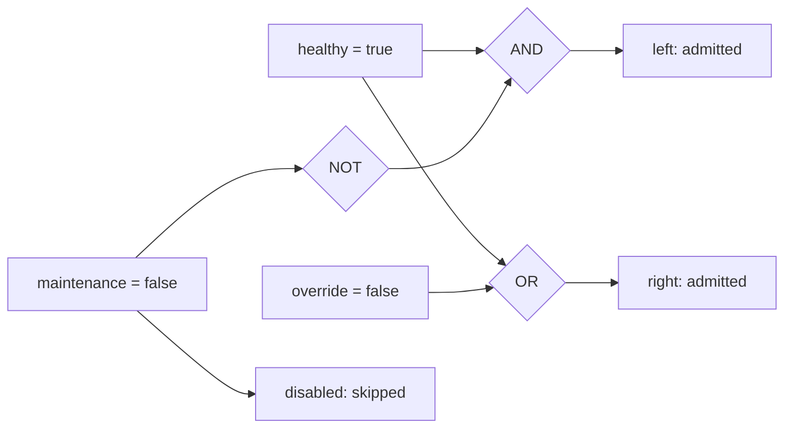

# Polyad scheduling guide

`polyad.balance` schedules cooperative `polyad.graph.Workload` implementations. It is part of the standalone Polyad project. It does not depend on Helm and is not yet a separately published PyPI distribution.

Polyad primarily schedules Kubernetes workloads through graphs. This local
backend can request pauses and save checkpoints only when application code
implements that contract and suitable persistent storage is configured. It does
not make arbitrary work resumable, and its checkpoints do not transfer Python
execution into Kubernetes containers.

Each workload exposes a `Work` description: stable name, input/implementation fingerprint, prerequisites, reserved execution
slots, memory reservation, initial statistics, and whether it supports checkpoints. Unknown durations and costs are represented
by `None`. Existing `polyad.graph.Operation` commands expose statistics too, but remain non-preemptible in `OperationQueue`.
Applications using OperationQueue retain their subprocess execution model.

## Scheduling and feedback

Use `routes={"next": DelayGate(30)}` with `polyad.graph.DelayGate` to wait after
dependencies complete before admitting a workload. The timer uses a monotonic
clock without occupying a worker; independent ready nodes can continue. Local
delay timers restart with a new scheduler process. Kubernetes delay gates instead
keep deadlines on graph status; see the [operator guide](../../../docs/operator.md#delay-gates).

`Scheduler` starts dependency-ready work that fits its slot and optional memory budgets. Workloads report cumulative
`Statistics(completed, total, estimate)` through `Control.report`. If remaining duration is unknown, observations update an
exponentially weighted throughput estimate: 30% new observation, 70% previous estimate. The scheduler estimates remaining time
as remaining units divided by that rate. These estimates and lifecycle transitions appear in `state.json` and `events.jsonl`.

The default `ShortestRemaining` policy prioritizes smaller estimated remaining durations. Unknown durations retain FIFO order
behind known ones. After 60 seconds waiting, aging takes priority. A running workload receives a cooperative pause request only
if it supports checkpoints, has run for at least five seconds, and provides known checkpoint/resume costs. Ordinarily, the
estimated remaining-time advantage, after uncertainty margins, must exceed those costs by at least one second. Aging can request
preemption for fairness instead. These are configurable scheduling heuristics, not calibrated probabilities or optimality claims.

Use `FIFO()` for submission order without preemption. Subclass the policy to supply different `rank` and `preempt` decisions.
Reordering ready work changes the schedule, not the dependency graph. `submit` adds a validated batch of workloads;
`dependencies` changes prerequisites of unstarted work. Both return acknowledgement futures and reject cycles or missing parents
without partially mutating the graph. Do not block waiting for an acknowledgement from the scheduler's own notification callback.

## Cooperative execution

```python
from polyad.graph import Control, Estimate, Outcome, Statistics, Work
from polyad.balance import Scheduler
from pathlib import Path


class Count:
    work = Work(
        "count", "inputs-v1:implementation-v1", resumable=True,
        statistics=Statistics(total=100, estimate=Estimate(checkpoint_seconds=0.01, resume_seconds=0.01)),
    )

    def run(self, control: Control, checkpoint: dict[str, object] | None) -> Outcome:
        start = int(checkpoint["next"]) if checkpoint else 0
        for index in range(start, 100):
            if control.cancel.is_set():
                # Release owned children/resources before returning.
                return Outcome()
            # Perform one recoverable unit here.
            control.report(Statistics(index + 1, 100, self.work.statistics.estimate))
            if control.pause.is_set():
                return Outcome({"next": index + 1})
        return Outcome()


Scheduler([Count()], slots=2, directory=Path(".cache/balanced-run"), diagrams=True).run()
```

The scheduler requests pause through an event; it does not freeze Python or serialize process memory. The workload must stop
its own children and return JSON state from a safe boundary. State must include everything its implementation needs to resume:
for chart work, that could include path IDs, seed, completed work, remaining queue and references to cached results.
Irreversible side effects need their own idempotency/transaction contract to avoid replay after a crash.

Running and pausing workloads retain their slot and memory reservations until they return and checkpoint serialization succeeds.
Other jobs can start during checkpointing if sufficient capacity is actually free. A scheduler exception requests cancellation
from every active workload and joins all worker threads. Uncooperative code can delay shutdown indefinitely; use process-owning
workload adapters for external binaries, and implement safe cancellation boundaries.

Checkpoint files use explicit JSON, SHA-256 integrity checks, input fingerprints and atomic replacement after flushing the file.
`restore=True` loads compatible checkpoints into new workload instances. Changed fingerprints and corrupted files fail loudly.
Completed work removes its checkpoint. This restores paused units, not an entire previous dynamic graph: callers must reconstruct
that graph and account for already completed external work. Each scheduler requires its own directory; `scheduler.lock` prevents
concurrent coordinators from writing the same journal. After a hard crash, verify the old coordinator has stopped before removing
a stale lock. This is a single-host scheduler, not a distributed lease service.

## Logs and diagrams

`events.jsonl` records graph additions and dependency changes, ready-queue ordering, progress and remaining-time estimates,
starts, pause requests, committed checkpoints, resumes, completions and failures. The notification callback receives readable
messages for graph and lifecycle changes; frequent progress observations remain in the journal.

With `diagrams=True`, `graph-000001.mmd` and subsequent Mermaid snapshots show dependency edges and workload states. No renderer
is required to write them. Open them in a Mermaid-compatible viewer. Event records distinguish `graph_changed` from
`schedule_changed`, so a priority change is not misrepresented as a dependency change.



## Composing graphs

`Graph` implements the same `Workload` interface as a leaf unit. A parent scheduler can therefore schedule a graph, a leaf,
or another level of nested graphs. Its `Work.requires` links it to sibling units or graphs. Successors unlock only after
all its children complete. Each graph has its own policy, dynamic membership, logs and optional diagrams.

```python
from pathlib import Path
from polyad.balance import Graph, Scheduler
from polyad.graph import Work

# fetch_units and analyze_units are application-provided Workload instances.
fetch = Graph(
    Work("fetch", "fetch-inputs-and-code-v1", slots=2, resumable=True),
    fetch_units,
    directory=Path(".cache/pipeline/fetch"),
)
analyze = Graph(
    Work("analyze", "analysis-inputs-and-code-v1", requires=("fetch",), slots=2, resumable=True),
    analyze_units,
    directory=Path(".cache/pipeline/analyze"),
)
Scheduler([fetch, analyze], slots=2, directory=Path(".cache/pipeline/root"), diagrams=True).run()
```

The graph boundary is a reservation and completion gate. While its children execute or checkpoint, the parent keeps the
whole graph allocation reserved. Child schedulers cannot allocate more slots or declared memory than that boundary. Reservations
are cooperative accounting, not operating-system CPU/memory quotas. Sibling graphs share the parent's budget; children balance
within their own allocation. This is hierarchical balancing, not unrestricted global work stealing.

Pause propagates down through nested schedulers. They stop dispatching new children, request checkpoints from resumable children,
and wait for non-resumable children to finish. The graph returns only after every child is quiescent. Its checkpoint captures
membership, dependency edges, completed children, pending work, statistics and child checkpoints. Resuming does not rerun completed
children. Cancellation similarly propagates and joins descendants before releasing the parent boundary.

For live mutations, the active child coordinator is available as `graph.scheduler`; use its `submit` and `dependencies` methods.
After a restart, supply `resolve(work)` to reconstruct dynamically added child implementations that are absent from the initial
unit list. The resolver must return the recorded identity and resource contract. Functions and live processes are never serialized.
Recreate the graph with matching fingerprints and pass its checkpoint through the parent scheduler's normal restoration mechanism.

## Repeated execution

Keep prerequisite edges acyclic. To run a finite graph repeatedly, use an
application loop that constructs a Graph for each run and calls its existing
execution API. Give independent runs distinct journal directories. The
application owns its iteration cursor, stop conditions and durable state;
propagate the same pause and cancellation signals into each active graph.
A completed child run should only advance the application cursor after its
result is recorded durably.

## Shutdown conditions and finalizers

An application loop limit cannot stop a worker that never returns. Use a scheduler
`ShutdownContract(after_seconds=300, grace_seconds=30)` to bound admission and request termination of active work as well.
`when(state)` can trigger shutdown from observed progress; `Scheduler.cancel()` requests the same shutdown lifecycle.

On shutdown, the coordinator stops admitting work, asks resumable units to checkpoint, and lets other units finish during the
grace period. When grace expires it signals cancellation, propagates it through nested graphs, and joins workers.
Unstarted work is reported as blocked, interrupted work as cancelled, and saved work as paused.

`Finalizer(name, finish)` names a cleanup acknowledgement. Pass finalizers through `ShutdownContract(finalizers=(... ,))`
or `Graph(finalizers=(... ,))`. They run after workers join on completion or termination, before the graph releases its
boundary. Cooperative scheduling pauses skip finalization so resumable state remains usable.

The callback receives `ShutdownState` and returns `True` only after durable cleanup. Returning `False` or raising an ordinary
exception keeps it pending and schedules another attempt. Completed finalizers are not retried within that activation.
Callbacks must be idempotent, quick and nonblocking; their order is not a dependency mechanism. Events record pending,
failed and completed finalizers. A grace deadline does not bypass them. If finalization is interrupted, the scheduler lock
remains for operator recovery; it is not a distributed lease or an automatic restart protocol.

This is cooperative termination, not a proof that arbitrary Python or external processes terminate. Workloads must observe
cancellation and own the shutdown and joining of their children. A worker that ignores cancellation, or a finalizer that never
acknowledges cleanup, can prevent shutdown from completing. Enforce a hard external process deadline where that guarantee is needed.

## Graph traversal ordering

Choose a strategy with `Scheduler(..., policy=BreadthFirst())` or `Graph(..., policy=DepthFirst())`.
Import strategies from `polyad.balance`.

| Strategy | Which ready unit starts next | Preemption |
| --- | --- | --- |
| `ShortestRemaining()` (default) | Lowest estimated remaining time, with aging for waiting work | Cooperative, when estimated benefit exceeds checkpoint costs |
| `FIFO()` | Earliest submitted unit | None |
| `BreadthFirst()` | Earliest node discovered by visiting all roots, then successive successor layers | None |
| `DepthFirst()` | Earliest node discovered by following one root's branch before the next | None |

Edges point from prerequisites to dependent work. All strategies wait for prerequisites to finish and for enough resources.
For two independent chains `A -> A1` and `B -> B1`, one worker runs breadth-first as `A, B, A1, B1`;
depth-first runs `A, A1, B, B1`. Submission order breaks traversal ties. Shared descendants are visited once, but still wait
for **all** prerequisites, even if discovered through a shorter route. Breadth-first layers are discovery distances from roots,
not barriers that force all work at one layer to finish together.

With several workers, these strategies determine admission priority, not completion order: other ready branches can start
while a preferred branch is busy. They do not interrupt active work merely to follow a traversal.

Each composed graph has its own strategy and resource boundary. Configure child graphs explicitly; the parent's strategy
does not flatten or override them. Repeated executions use application control flow; prerequisite waits remain acyclic.

Priorities are recomputed from the current graph on each scheduling pass, including after insertion or dependency changes.
Breadth-first and depth-first priority construction take O(V + E) time and O(V + E) auxiliary space for V units and E edges
within that boundary. Sorting R ready units adds O(R log R). These costs describe ordering, not execution or checkpointing.

## Try a live graph rewrite

From the project root, install the development dependencies, which include Matplotlib, then run:

```bash
poetry install --with dev
poetry run python examples/heartbeat.py
```

The example does no useful computation. Each unit waits one second, prints a healthy heartbeat and reports progress.
While the root is running, it adds two branches and a join, then rewrites the join to wait for both branches.
Two workers process the branches concurrently. A maintenance-only branch is skipped by its routing rule.

The command prints its output directory under `.cache/balance/`. Override it with `--output <fresh-directory>`.
You get a PNG for the initial graph and every structural rewrite, Mermaid lifecycle snapshots, and an ordered
`events.jsonl` journal. PNGs show prerequisite edges; routing decisions and their observations are recorded in the journal.
Enable this on your own `Scheduler` or composed `Graph` with `plots=True`; matplotlib is imported only when plotting is requested.
These snapshots describe each local scheduling boundary, not a flattened view of all nested graphs.

### What the rewrites produce

These snapshots come from the runnable example above and are included in the repository.

| Initial graph | Add branches | Rewrite the join |
| --- | --- | --- |
|  |  |  |

The first rewrite adds four units. The second adds `right` as another prerequisite of `join`, creating a fork–join.
These images show dependencies at each revision, before routing decides which units execute.
The `disabled` unit is present in the graph but is skipped because maintenance is false.

## Boolean routing rules

```python
from polyad.graph.gates import AND, OR, NOT, XOR, NXOR, Signal

routes = {
    "deploy": AND(Signal("healthy"), NOT(Signal("maintenance"))),
    "notify": OR(Signal("changed"), Signal("override")),
}
# Pass routes=routes and facts=read_current_observations to Scheduler or Graph.
# The callback returns a snapshot such as {"healthy": True, "maintenance": False}.
```

The example's routing expressions are shown separately here. Arrows into gates carry Boolean observations;
they are not prerequisite edges. Each target must also satisfy its workload prerequisites.



Rules are evaluated after prerequisites complete. True admits the unit; False skips it permanently for that activation.
A missing signal is unknown, including when negated. Unknown rules wait for another observation or a shutdown condition;
configure a shutdown deadline if observations might never arrive. AND can resolve False from one false operand, and OR can
resolve True from one true operand without knowing the others.

XOR means an odd number of true operands; NXOR (also called XNOR) means an even number. For two operands these mean
“different” and “equal”. NAND and NOR can be expressed as `NOT(AND(...))` and `NOT(OR(...))`.

Prerequisites remain mandatory: OR does not mean “ignore an unfinished prerequisite”. A skipped prerequisite skips its
dependent branch, and skipped work does not execute or masquerade as successfully completed work. Routing never cancels an
already admitted unit; paused units resume their existing admission. A selected branch may contain a composed graph.

The observation callback runs on the coordinator and must be quick. If workers update observations, provide a synchronized
snapshot (the example uses an Event). Health observations are application reports, not independent process health probes.
This is admission routing, not failure recovery: an execution exception still invokes the scheduler's failure cleanup.
Include routing logic and relevant observation configuration in your workload fingerprints when using checkpoints.

## Transactional graph rewrites

Each Scheduler and Graph owns a separate rewrite registry. Names are local to that boundary; a parent and
child can both register an operation called "expand" without overriding one another. Registration does not execute a rewrite.

~~~python
from polyad.graph import Rewrite

graph.rewrites.register(
    "split-task",
    Rewrite.split(
        "task",
        (left_partition, right_partition),
        links=(("join", ("left", "right")),),
    ),
)
# From application or worker code, while graph is active:
graph.rewrite("split-task").result()
~~~

The coordinator validates the entire proposed graph before committing anything: unique identities, existing endpoints,
resource reservations, acyclic prerequisites and lifecycle eligibility. One committed transaction generates one local
graph-change event and, with plots enabled, one PNG. Ordinary submit() and dependencies() requests use the same transaction
path. Rejected proposals produce a rejection event and an exception on their acknowledgement future.

| Constructor | Structural change |
| --- | --- |
| Rewrite.split | Replace one unit with supplied partitions and optional join units |
| Rewrite.fuse | Replace several units with a supplied combined implementation |
| Rewrite.splice | Insert a unit and reconnect a downstream target |
| Rewrite.prune | Remove named units with explicit surviving connections |
| Rewrite.replace | Substitute a subgraph and reconnect its external consumers |
| Rewrite.replicate | Add independent replicas and explicit consumer connections |

These operations do not synthesize worker implementations, partition data, prove equivalence, or select replica results.
The application supplies those semantics and each full replacement prerequisite list. Dangling edges cause rejection;
Polyad never guesses which prerequisite should be bypassed.

Only unstarted units without checkpoints may be removed, replaced or rewired. Unaffected running work retains ownership and
continues. Rewrites do not silently discard progress or cancel active workers.

Registry definitions live in application code, rather than serialized callbacks. Graph checkpoints retain the resulting
membership and removal records. Reconstruct registry definitions when restarting a process and provide a resolver for
new or replaced implementations. Repeated application is not implicitly idempotent.

## Recursive shape hashes

~~~python
print(graph.shape_hash)
~~~

Polyad hashes canonical JSON using SHA-256 with a versioned domain separator. A dependency graph includes its labeled nodes,
prerequisite edges, routing expressions and each nested boundary's hash. This forms a Merkle-style hierarchy over containment:

~~~mermaid
flowchart BT
    left["Left child: hash(local shape)"] --> parent["Parent: hash(local shape + child hashes)"]
    right["Right child: hash(local shape)"] --> parent
    parent --> root["Root: hash(local shape + parent hash)"]
~~~

Changing a child changes its ancestor hashes when read. Running coordinators observe descendant changes on their next
scheduling pass, log before/after hashes and export another revision plot when plotting is enabled. Local shape snapshots
publish atomically; this is not a globally locked snapshot across independently changing graph boundaries.

Submission order, statuses, runtime measurements, resource estimates and workload fingerprints do not affect the shape hash.
Node names, edges and the syntax of routing expressions do. This is identity for a **labeled structure**, not a graph-isomorphism
test, semantic equivalence proof, cache key for results, or checkpoint-integrity replacement. Commutative Boolean expressions
written in different operand orders can have different hashes.

Containment must remain acyclic. A shape hash describes the currently represented hierarchy;
it does not describe future graphs that application control flow may construct.

Hashes are recomputed, not cached, so child changes cannot leave an ancestor's cached value stale. Computation visits the
currently represented hierarchy and sorts local node/edge descriptions. A large hierarchy can make frequent hash observation
expensive; incremental propagation is a possible later optimization.
