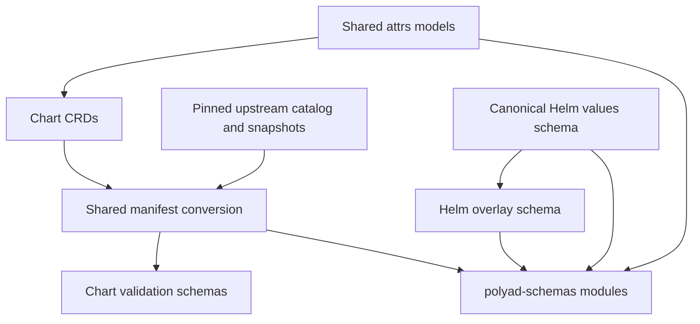

# Central schema sources

One generation pipeline produces chart validation files and the standalone
`polyad-schemas` distribution. Edit the canonical source for a contract, then
regenerate both copies. Generated JSON files are never independent sources.

## Table of contents

- [Source ownership](#source-ownership)
- [Regenerate and check](#regenerate-and-check)
- [Refresh upstream contracts](#refresh-upstream-contracts)
- [Distribution formats](#distribution-formats)

## Source ownership

| Contract | Canonical source |
| --- | --- |
| Shared Python models and events | `pkg/polyad-types/polyad_types/` attrs models and field metadata |
| Polyad manifests | `charts/polyad/crds/`, with modeled subtrees regenerated first |
| Helm configuration | `charts/polyad/values.schema.json` |
| Dragonfly | Vendored `charts/polyad/crds/dragonflies.yaml`; no second snapshot |
| Gateway API, Istio, KEDA and External Secrets | [sources.json](sources.json) and verified snapshots under [upstream](upstream/) |
| Upstream licenses | Catalogued files under [licenses](licenses/) and `charts/polyad/LICENSE.dragonfly-operator` |



`sources.json` records each upstream release, source URL, group/kind/version,
snapshot path, SHA-256 digest and license. Bundled dependencies also record their
chart version. Generation fails if a dependency pin disagrees with `Chart.yaml`
or a snapshot or license digest changes unexpectedly.

Generated `$comment` annotations identify source provenance. The chart outputs
live under `charts/polyad/schemas/`; package outputs are grouped into
`polyad_schemas.models`, `.resources`, `.events` and `.helm`.

## Regenerate and check

From the repository root:

```sh
poetry run python scripts/schemas/generate-all.py
poetry run python scripts/schemas/generate-all.py --check
```

The pipeline refreshes modeled CRD subtrees, Helm overlays and events before
generating both distributions. Both commands use local files only. Check mode
reports modified, missing and obsolete outputs without writing files. Generation
removes obsolete generated schema and license files.

The `schema-artifacts` pre-commit hook and CI run the complete check when sources,
generators, chart pins or generated outputs change. Tests compare both copies,
validate chart output, and verify isolated wheel imports and license inclusion.

## Refresh upstream contracts

Update the release and source URLs in `sources.json`. When the chart installs the
dependency, update its catalog pin together with `Chart.yaml` and `Chart.lock`.
Then run:

```sh
poetry run python scripts/schemas/generate-all.py --refresh-upstream
```

This explicit operation downloads only the pinned CRDs and licenses, extracts
the requested served API versions, and records snapshot digests. Downloads and
extraction must all succeed before any snapshots are written. Review source and
generated changes, then run chart tests and Kubeconform before committing.

Dragonfly's installable CRD remains sourced from its locked Helm dependency;
follow the [Dragonfly refresh instructions](../charts/polyad/UPSTREAM.md).

## Distribution formats

Chart manifests use Draft 7 for Kubeconform; packaged manifest schemas use Draft
2020-12. Both contain the same converted constraints, resource identity and
provenance. Only the dialect declaration differs. OpenAPI nullability and
exclusive bounds are converted; Kubernetes CEL remains an annotation for the
cluster to enforce.

See the [schema API](../docs/apis/json-schemas.md) and
[standalone package](../pkg/polyad-schemas/README.md) for imports and validation.
