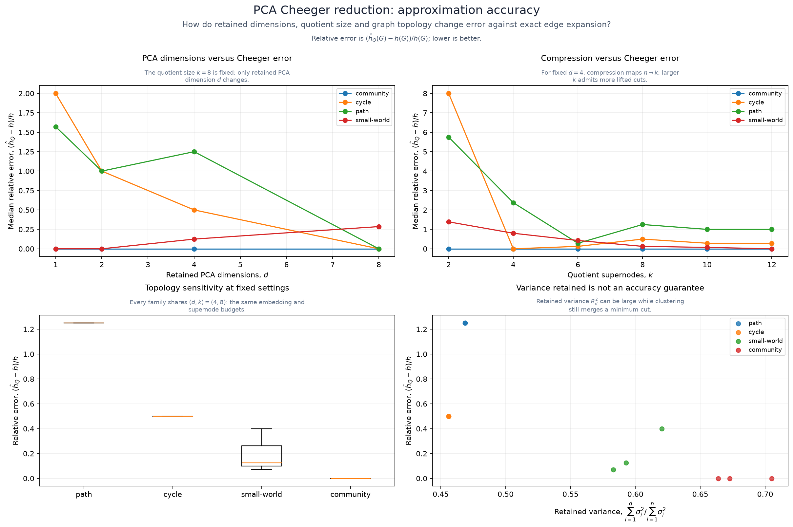
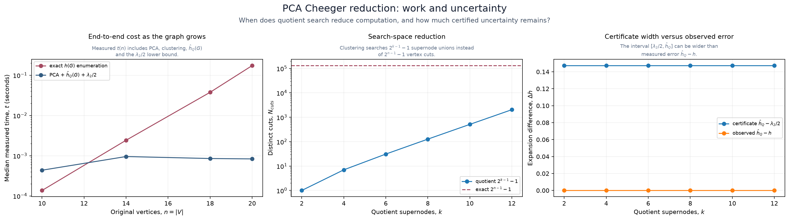
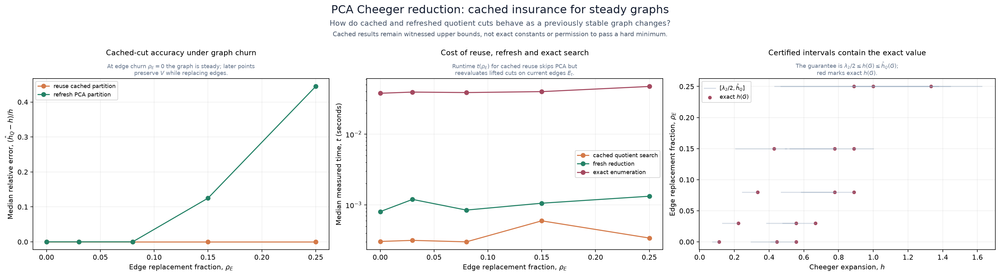

# PCA-guided Cheeger reduction (deprecated)

<!-- toc:start -->
**Table of contents**

- [Method](#method)
- [What is certified](#what-is-certified)
- [Controlled sweeps](#controlled-sweeps)
- [Steady-graph insurance](#steady-graph-insurance)
- [Run](#run)
- [Interpret the plots](#interpret-the-plots)
- [Limitations and production criteria](#limitations-and-production-criteria)
<!-- toc:end -->

This study is archived and excluded from all refresh suites and CI study runs.
Its recipe, recorded results and figures are retained unchanged for reference.
Use the active [Cheeger strategy study](../cheeger-strategies/README.md) for new runs.

This local study asks whether a graph can be compressed before searching its
Cheeger cuts, and what accuracy and assurance are lost. PCA remains an experimental
comparison. The companion [strategy selection study](../cheeger-strategies/README.md)
measures the production opt-in spectral selector, its cache, threshold decisions
and exact fallback on changing graphs.

## Method

The study treats each vertex's adjacency row as a structural feature vector,
centers those vectors, and applies singular-value decomposition for PCA. It then
uses deterministic farthest-first k-means to group the retained coordinates into
`k` supernodes. The reduced search considers every union of those clusters.

Each candidate cluster cut is lifted back to the original graph before its edge
boundary and vertex count are measured. Thus the reduced search changes the
set of cuts considered, not the definition of a cut:

```text
adjacency rows -> PCA coordinates -> vertex clusters -> cluster-union cuts
                                                      -> original-graph ratio
```

With `n` original vertices and `k` supernodes, exhaustive work falls from
`2^(n-1)-1` to `2^(k-1)-1` cuts. PCA itself is polynomial work and can dominate
small graphs; the cost plot measures the complete PCA, clustering, spectral-bound
and quotient-search path rather than reporting only its cheaper enumeration.

This is PCA over adjacency signatures, not a claim that the graph has ordinary
independent Euclidean features. High retained variance is reconstruction evidence;
it is not proof that the minimum bottleneck cut survived clustering.

## What is certified

The quotient result is a **certified upper bound** on the exact Cheeger constant.
Every reported value has a concrete cut in the original graph, while excluding
other cuts can only miss a smaller value. The study also computes `lambda2 / 2`
from the combinatorial graph Laplacian as a lower bound for the same unnormalized
edge-expansion definition. The exact value therefore lies in:

```text
spectral lower bound <= exact Cheeger constant <= lifted quotient upper bound
```

The interval remains valid without exhaustive enumeration. Its width is a safe
uncertainty measure, but it can be loose. `absoluteError` and `relativeError` use
an exhaustive reference and are available only because the study graphs remain
small enough to solve exactly. They are evaluation metrics, not production
certificates.

An upper bound below a required minimum proves a violation. An upper bound above
the minimum does **not** prove compliance; a sufficiently large certified lower
bound can. This asymmetry makes the interval useful for early policy decisions,
prioritizing likely cuts, monitoring, and deciding when exact recomputation is
worthwhile. The companion study measures those actual production decisions.

## Controlled sweeps

[`fixtures/scenario.json`](fixtures/scenario.json) declares every varied axis.
The full reduction sweep holds vertex count constant while crossing:

- graph family: path, cycle, small-world and two-community;
- retained PCA dimensions;
- quotient supernode count; and
- reproducible graph seed.

The plotting code then selects one fixed supernode count for the dimension plot,
one fixed component count for the compression plot, and both fixed settings for
the topology comparison. This prevents correlated parameter changes from being
presented as the effect of one axis.

A separate size sweep holds topology, components and supernode budget constant
while changing original vertex count. It compares exact enumeration with the
entire approximation pipeline. Edge count is recorded for every graph so density
and topology effects remain inspectable in `results.json`.

The current production metric ignores edge weights, directions, duplicate edges
and self-loops. The study deliberately does not add weight variability that would
measure a different Cheeger definition.

## Steady-graph insurance

The stability sweep computes PCA clusters once, replaces a controlled fraction
of baseline edges without changing vertex identities, and reevaluates the cached
cluster cuts on the current graph. It compares that reuse with freshly computed
PCA clusters and an exact reference.

Cached reuse never reuses a stale numeric value: current edges always determine
the lifted cut ratio. This makes it a plausible low-cost witness for a steady
graph. A production policy could use topology generation and churn thresholds to
schedule refreshes, but should fall back to fresh reduction or exact search when:

- vertices are added, removed or renamed;
- the certified interval crosses a hard policy threshold;
- edge churn exceeds a calibrated limit;
- the cached witness degrades materially; or
- the lower bound cannot prove a required hard minimum.

## Run

This archived study is no longer accepted by the refresh CLI. Historical result
identifiers and provenance paths retain their original `cheeger-reduction` name.
The computation helpers remain available because the active strategy study shares
them. The original implementation is
`polyad_benchmarks.cheeger_reduction.reduction_study`; plotting is isolated in
`polyad_benchmarks.studies.cheeger_reduction.plotting`.

## Interpret the plots



The accuracy figure separates retained dimensions from the number of supernodes,
then shows topology sensitivity and why retained PCA variance is not an error
bound.



The cost figure compares end-to-end measured duration, theoretical cut counts,
observed error and the certified interval width. A speedup is meaningful only
when PCA and clustering overhead are included.



The stability figure compares cached and refreshed reductions as edges change,
including their runtime and the interval containing each exact study reference.

## Limitations and production criteria

PCA can merge the two sides of a narrow bridge because preserving global
adjacency variance is not the same objective as preserving minimum cuts. Cluster
count generally matters more directly than PCA component count: it determines
which unions can be searched. Symmetric graphs can also have unstable embeddings
even when their Cheeger constants are stable.

Polyad now has an [optional spectral selector](../../docs/graphs/cheeger-tuning.md)
whose result exposes lower and upper bounds, stage, exactness and cache churn.
It can settle a hard policy from a certified interval and otherwise escalates to
exact search. PCA in this study is still a separate heuristic. Use the companion
study's measured strategy transitions, cost and budget probes before choosing
deployment settings; neither study establishes a universal safe churn default.
