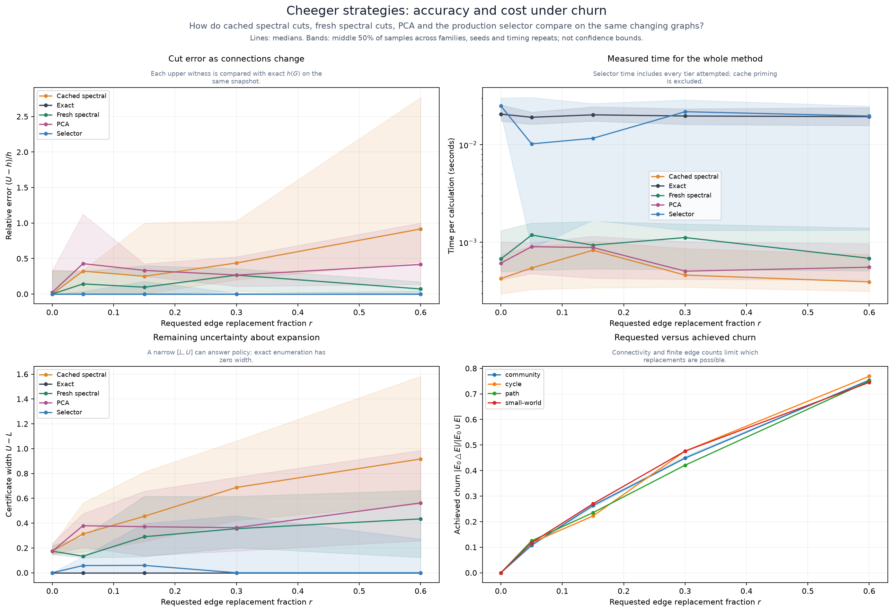
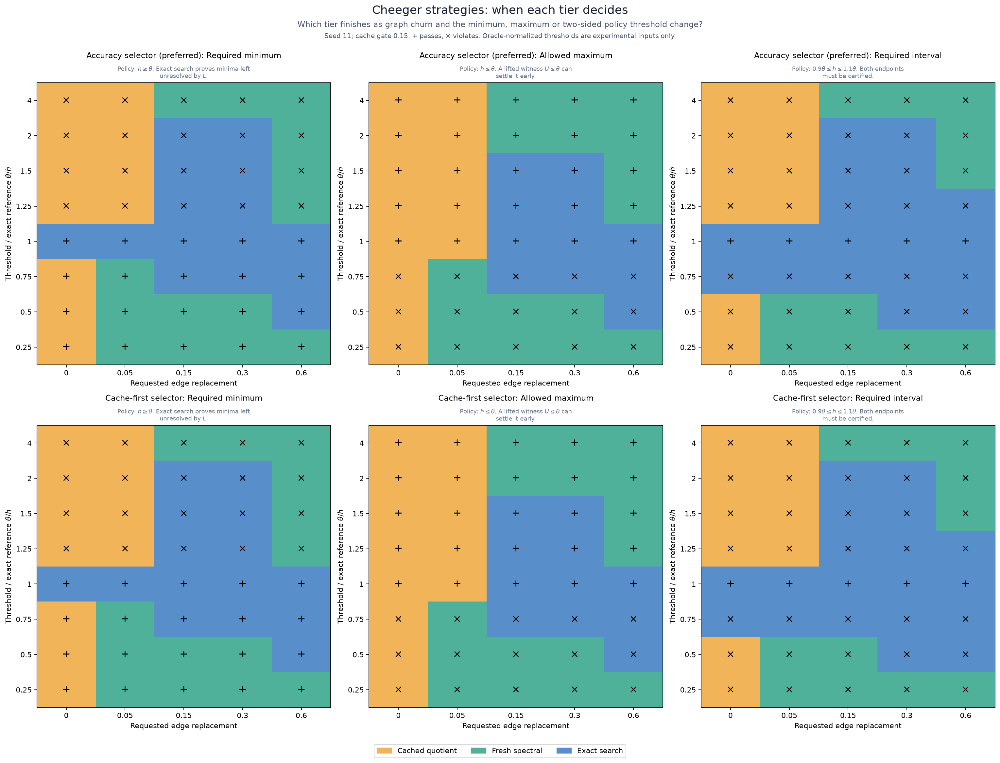
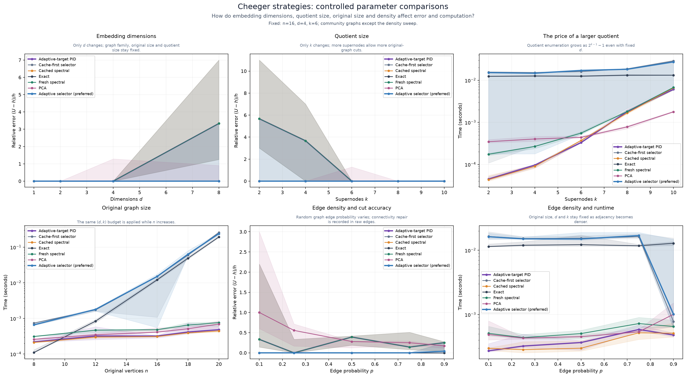
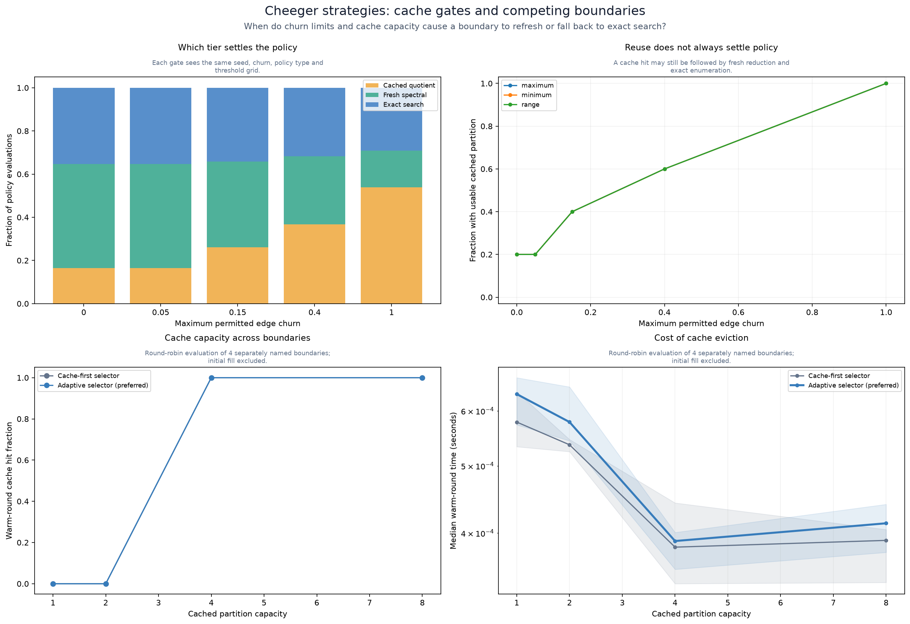
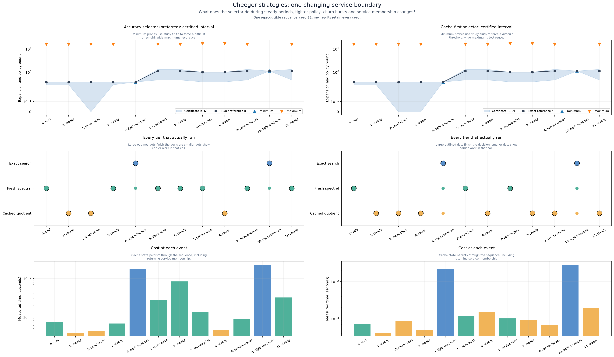
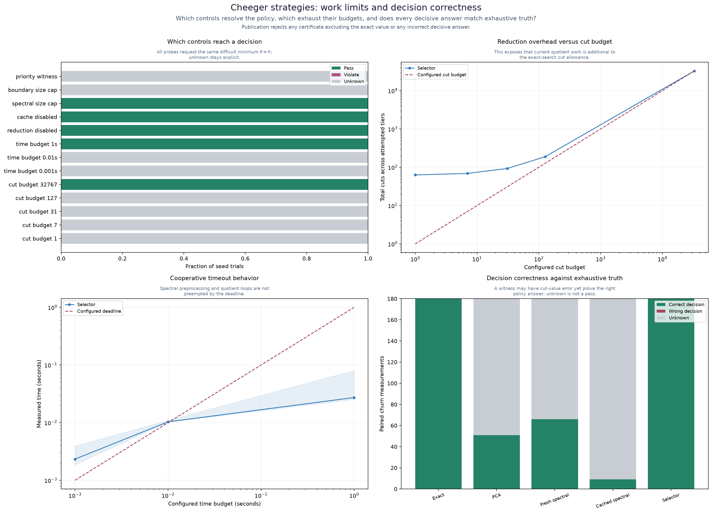
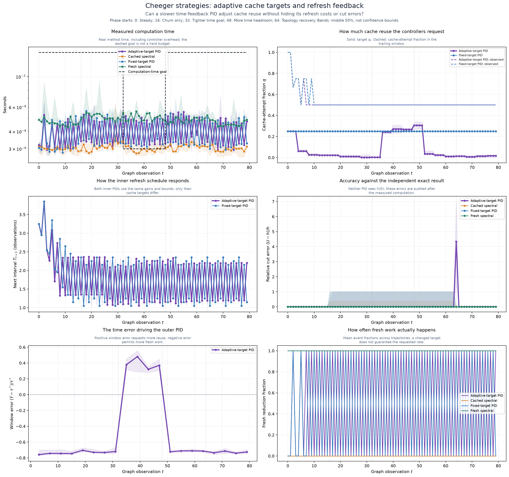
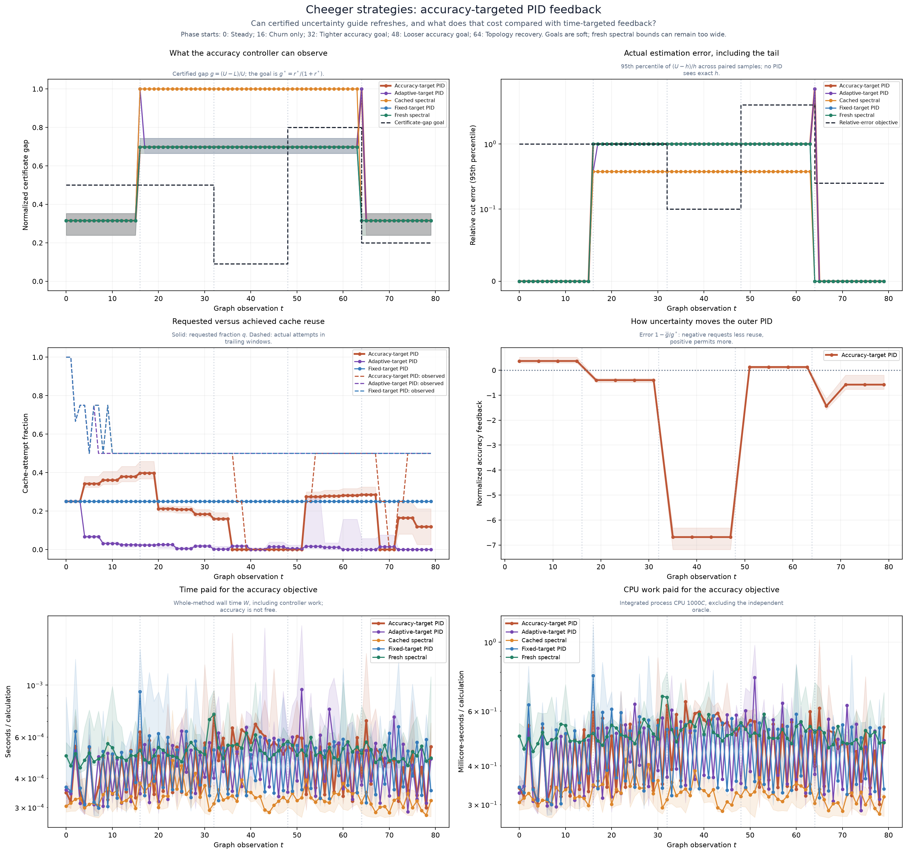
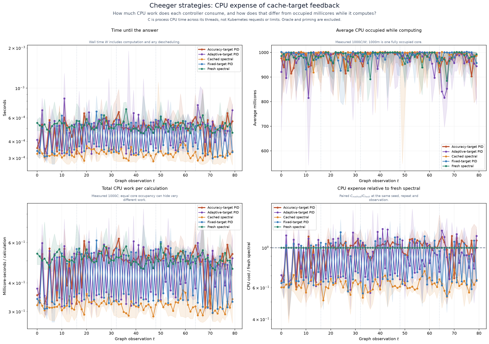
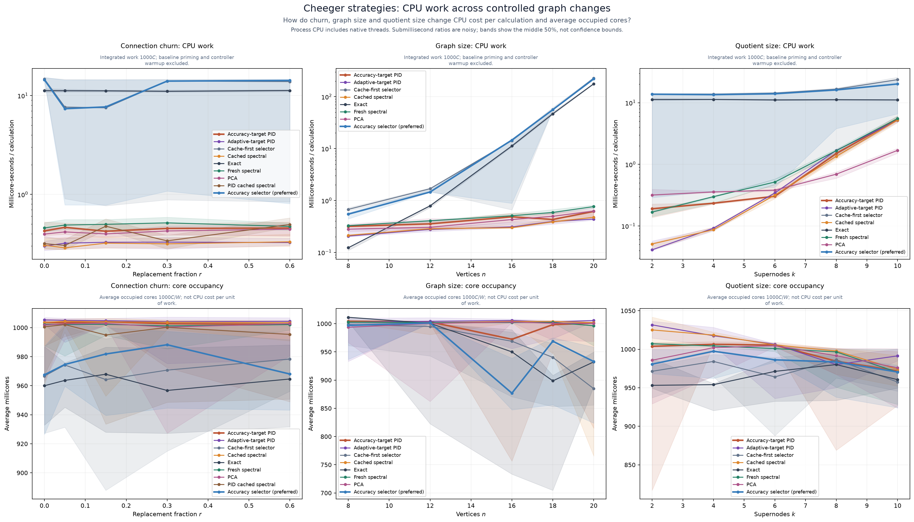

# Cheeger strategy selection under graph change

<!-- toc:start -->
**Table of contents**

- [Questions and figures](#questions-and-figures)
- [Findings from the published local run](#findings-from-the-published-local-run)
- [Published graphs](#published-graphs)
- [What accuracy means](#what-accuracy-means)
- [Experimental axes](#experimental-axes)
- [PID-controlled refresh experiment](#pid-controlled-refresh-experiment)
- [Adaptive cache-target experiment](#adaptive-cache-target-experiment)
- [Accuracy-targeted feedback](#accuracy-targeted-feedback)
- [Measuring CPU expense](#measuring-cpu-expense)
- [Churn and cache semantics](#churn-and-cache-semantics)
- [Current runtime limits exposed by the study](#current-runtime-limits-exposed-by-the-study)
- [Reproduce](#reproduce)
<!-- toc:end -->

This local study runs Polyad's production Cheeger selector on reproducible graph
snapshots. It compares exact enumeration, adjacency PCA, fresh Laplacian spectral
reduction, reused spectral partitions, PID-controlled spectral refresh, and both
adaptive and cache-first complete selectors. **Accuracy-targeted PID is now the
preferred feedback mode when Cheeger reduction is enabled.** It controls a
certified uncertainty bound, not an oracle-provided error. The original
time-targeted **Adaptive-target PID** remains a separate comparator and selectable
runtime mode (`feedback: ComputationTime`). Reduction itself remains
opt-in at both operator and policy levels; `strategy: CacheFirst` at either level
retains legacy ordering. The production scheduler and study use the same PID
implementation. See the [operator values reference](../../charts/polyad/references/values-cheeger.reference.yaml)
and [configuration guide](../../docs/graphs/cheeger-tuning.md).
The archived [PCA reduction study](../cheeger-reduction-deprecated/README.md) keeps its
original dimension and compression experiments; this study adds the production
strategy transitions and administrator controls.

All figures have plain-language titles, descriptions below each subplot title,
and mathematical notation for the quantities plotted. Every PNG has a matching
SVG in [figures](figures/), and [results.json](results.json) retains individual
observations, reconstructable graph snapshots, recipes and source hashes.

## Questions and figures

| Figure | Question | Controlled variables |
| --- | --- | --- |
| [Churn](figures/churn.svg) | How accurate and expensive is each strategy, including PID refresh, as edges change? | Same snapshots, policy, dimensions and quotient size; baseline-only warmup for adaptive comparisons |
| [Activation](figures/activation.svg) | Which tier settles a minimum, maximum or two-sided policy? | Fixed graph family, seed and cache gate; vary churn and threshold |
| [Parameters](figures/parameters.svg) | How do dimensions, supernodes, graph size and density affect the result? | One plotted axis at a time; unplotted settings fixed |
| [Cache](figures/cache.svg) | How do churn gates and competing graph boundaries affect reuse? | Same policy grid for each churn gate; four distinct boundaries for capacity |
| [Timeline](figures/timeline.svg) | What happens during steady periods, churn, policy changes, joins and departures? | One persistent cache and an ordered event sequence |
| [Controls](figures/controls.svg) | Which budgets resolve the policy, and are decisive answers correct? | Same difficult minimum for work-limit probes |
| [PID feedback](figures/pid-feedback.svg) | Can a slower PID adjust the cache target to a computation-time goal? | Same ordered snapshots, inner gains and initial target; change churn and time goal in separate phases |
| [PID CPU cost](figures/pid-cost.svg) | How much CPU work does each feedback strategy consume relative to fresh spectral? | Same seed, repetition and observation; process CPU time measured separately from wall time |
| [CPU parameter costs](figures/cpu-cost.svg) | How do churn, graph size and quotient size change CPU expense? | Same controlled slices as the accuracy plots; distinguish occupied cores from integrated CPU work |
| [Accuracy feedback](figures/pid-accuracy.svg) | Does certificate-gap feedback improve actual error, and what does it cost? | Same snapshots and 1.5 ms time goal; vary churn and relative-error objective in separate phases |

## Findings from the published local run

The run contains **19,338 measurements across 101 distinct named graph snapshots**,
including 3,600 threshold-and-churn-gate trials across both selectors. Repeated timings and isomorphic
named boundaries are not independent topologies. All sampled certificates
contained the exact reference; all 10,763 decisive answers agreed with it. The
remaining 8,575 observations were explicitly unresolved, mainly reduced-method
comparators that could not certify the requested minimum.

- **Reuse degrades under churn.** At 60% requested edge replacement, the pooled
  median cached-cut relative error was 91.7%, versus 41.7% for PCA and 7.1% for
  fresh spectral reduction. These are pooled medians, not worst-case bounds;
  the raw records retain the full spread.
- **PID trades reuse for scheduled refreshes.** Across 180 additional
  observations, the controller attempted cache reuse 108 times and scheduled
  fresh reduction 72 times. Its pooled median cut error at 60% replacement was
  7.1%, matching fresh reduction because it refreshed at that step. It did not
  reach its zero-cache target in this short replay. A newer partition is not
  always a better one: at 30% replacement, its median error was 55.0%, versus
  43.8% for the original cached partition. This is a refresh-policy experiment,
  not evidence of uniformly better cuts or a tuned controller.
- **An adaptive target does not guarantee faster computation.** The preserved
  time-feedback replay now contains 3,600 observations across five methods. In
  its 0.3 ms goal phase, the time-targeted controller requested a median cache
  rate of 28.8% and attempted reuse on 50.7% of calls, versus 50.0% for the fixed
  target. Median method times were 0.490 ms for the adaptive time target and
  0.471 ms for the fixed target. Both missed the goal.
  This run does not establish a consistent latency advantage. Time goals, short
  windows and integer observation schedules can produce similar actions despite
  different requested rates.
- **CPU occupancy is not total expense.** The feedback comparators occupied
  approximately 1000m while computing. Median CPU work per calculation was
  0.320 millicore-seconds for cached spectral, 0.440 for fixed-target PID,
  0.464 for time-targeted PID, 0.506 for accuracy-targeted PID and 0.508 for
  fresh spectral. Median paired CPU ratios against fresh spectral were 0.623,
  0.795, 0.841 and 0.998 respectively.
  These CPU-only comparisons do not assert equal cut accuracy or policy power.
- **The raw time-targeted comparator can retain inaccurate cuts.** After baseline-only
  warmup, its pooled median error at 60% requested replacement was 91.7%, like
  the raw cached comparator. It does not see accuracy feedback. The complete
  adaptive selector still enforces churn guards and certified decisions; its
  median cut error in the same slice was zero after necessary exact fallback.
- **Accuracy feedback improves the high-churn comparison at a CPU cost.** At
  60% replacement, the new raw accuracy-targeted PID's median cut error was
  7.1%, matching fresh spectral, versus 91.7% for the time-targeted PID. Median
  CPU work increased from 0.326 to 0.457 millicore-seconds per calculation.
  These warm-query comparisons exclude controller warmup, and do not show a
  universal improvement on every graph or observation.
- **A soft accuracy objective can remain unachievable.** In the original time
  replay, none of the accuracy controller's reduced certificates could certify
  its fixed 25% objective, even though median actual cut error was zero. It
  refreshed on 83.8% of calls. Loose lower bounds, not only stale cuts, drive
  this signal. Its maximum observed error was 100%, versus 700% for the
  time-targeted controller in that replay.
- **Changing accuracy goals exposes transient risk.** The additional 3,600-call
  accuracy replay independently tightened and relaxed the error objective.
  Reduced certificates met it on 40% of the accuracy controller's calls. Both
  accuracy- and time-targeted methods still had a 700% transient error during
  topology recovery. The new 95th-percentile panel makes that spike visible;
  causal feedback cannot retroactively repair a cut already returned.
- **Thresholds decide whether the cheap tiers are useful.** Per selector, across
  the threshold grid, cached cuts settled 538 calls, fresh reduction settled 666,
  and exact search finished 596. The two selectors matched because every probe
  starts with a cold controller. These are experimental-grid counts, not expected
  production frequencies.
- **The selector is not always faster than exact-only.** In the unchanged-graph
  comparison, the minimum policy still required exact enumeration in 33 of 36
  calls for each selector. Trying reduced tiers first added overhead. A good upper witness
  alone cannot prove a minimum; its lower bound must also reach the threshold.
- **More dimensions need not improve clustering.** With six supernodes on the
  community cases, eight spectral dimensions worsened median cut accuracy
  compared with one, two or four. More supernodes improved these sampled cuts,
  but increased quotient-search cost exponentially.
- **Capacity matters independently of churn.** Cycling through four boundaries
  produced no warm-round cache hits with one or two entries, and all hits with
  four or eight entries, under the deliberately permissive maximum policy.
- **The current budget is not end-to-end.** A one-cut allowance still performed
  63 cuts: 31 cached, 31 fresh and one exact. See the limitations below before
  treating `maxCuts` or the cooperative timeout as a hard work ceiling.

These findings support threshold-aware escalation, not a blanket claim that
reduction is faster or that one churn setting is universally safe. Timings are
from one ARM64 macOS host; the recorded runtime section identifies the software
versions and numerical-library thread controls.

## Published graphs





















## What accuracy means

The study uses Polyad's simple, undirected, unweighted projection and measures
unnormalized edge expansion:

```math
h(G) = \min_{\varnothing \ne S \subsetneq V}
\frac{|\partial S|}{\min(|S|, |V \setminus S|)}.
```

An independent Gray-code exhaustive implementation supplies the reference for
each graph snapshot. The production exact solver is separately timed and its
answer checked against that reference. Every reduced candidate cut is lifted
to the original graph. Its ratio is an upper bound $`U`$; the combinatorial
Laplacian supplies $`L=\lambda_2/2`$. The cached spectral lower bound is reused
only for an identical edge set; after an edge change it becomes zero until fresh
spectral work runs.

We distinguish three quantities:

- Cut error: $`(U-h)/h`$, measured using the independent reference.
- Certificate uncertainty: $`U-L`$, available without exact enumeration.
- Decision correctness: whether a decisive policy answer agrees with the oracle.
  An unresolved interval is explicitly `Unknown`, never counted as a correct pass.

A nonzero cut error can still give a correct, certified policy decision. The
selector stops when $`U<\theta_{\min}`$ proves a violation, $`L>\theta_{\max}`$ proves
a violation, or the whole interval fits the requested bounds. It escalates when
the interval does not settle them. Inclusive comparisons use the production
tolerance. Publication fails if any sampled interval excludes its reference or
any decisive answer disagrees with the reference. These checks validate the
sampled graphs; they do not constitute a proof about all graphs or all numerical
conditions.

Laplacian clustering itself is a heuristic partitioning method. The assurance
comes from rescoring original-graph cuts and the spectral lower bound, not from
a claimed spectral-preservation theorem for the clustering. PCA remains a
comparison method, and expander decomposition is not implemented in this study.

## Experimental axes

The complete executable recipe is [scenario.json](fixtures/scenario.json).

| Axis | Published recipe |
| --- | --- |
| Graph families | Path, cycle, small-world and two-community |
| Baseline size | 16 vertices |
| Size sweep | 8, 12, 16, 18 and 20 vertices |
| Retained dimensions $`d`$ | 1, 2, 4 and 8 |
| Quotient supernodes $`k`$ | 2, 4, 6, 8 and 10 |
| Random-graph edge probability | 0.1, 0.25, 0.5, 0.75 and 0.9 |
| Requested edge replacement | 0%, 5%, 15%, 30% and 60% |
| Cache churn gate | 0, 0.05, 0.15, 0.4 and 1 |
| Threshold relative to exact reference | 0.25, 0.5, 0.75, 1, 1.25, 1.5, 2 and 4 |
| Policy shape | Minimum, maximum and two-sided range |
| Cache capacity | 1, 2, 4 and 8 partitions across four boundary identities |
| Exact-search cut allowance | 1, 7, 31, 127 and 32,767 |
| Cooperative timeout | 1 ms, 10 ms and 1 second |
| Additional controls | Reduction disabled, cache disabled, spectral size cap, boundary size cap and a priority cut |
| Graph seeds / timing repeats | Three seeds; three repeats for matched method comparisons |
| PID refresh controls | Gains $`K_p=0.6`$, $`K_i=0.4`$, $`K_d=0.2`$; zero target cache attempts; initial interval 4 observations, bounded to [1, 8] |
| Adaptive comparison controls | 1.5 ms soft goal; 12 baseline-only warmup observations; initial cache target 0.25, bounded to [0, 0.8] |
| Accuracy comparison controls | 25% soft relative-error objective in parameter sweeps; independent accuracy replay varies objectives from 10% to 400% |

Dimension and quotient settings are crossed in the raw data. The parameter plots
hold one fixed when showing the other's effect. Density plots use random graphs
with a connecting edge added between disconnected components; achieved density
and those actual edges are retained. The graph-size plot holds $`d=4`$, $`k=6`$ and
the community family fixed. The churn figure pools graph families to show
variability; it must not be read as a topology-specific accuracy guarantee.

The activation grid sets thresholds relative to an already enumerated reference
to probe both sides of each decision boundary. That is an experimental technique;
the production selector never receives the reference. Each threshold call starts
with the same baseline cache state. The timeline and cache-capacity sweep instead
preserve cache history across calls. Their distinction matters when interpreting
how often a refresh occurs.

The **Accuracy selector (preferred)** legend is the production `Selector` record:
it uses the certificate-gap scheduler, honors churn and resource gates, and performs
exact fallback when certificates cannot resolve a policy. **Cache-first selector**
uses the same safety logic with legacy ordering. Both appear in the activation,
cache, timeline and control comparisons. The threshold grid starts with a cold
controller and a primed partition, so it mainly isolates threshold and churn
effects, not steady-state feedback.
The cache figure's threshold panels and the controls figure's decision bars show
the preferred selector; their capacity, runtime and cut-work comparisons include
both complete selectors.

The **Adaptive-target PID** (time feedback) and **Accuracy-target PID**
(certificate feedback) lines are raw cached/fresh comparators: neither
performs hidden exact fallback, and both use a permissive churn gate. They appear
in churn, dimension, quotient-size, graph-size and density sweeps. For these
independent comparisons, both adaptive comparators and both full selectors receive
12 baseline-only warmup calls before measuring the query. Controller warmup sees
no future graph or oracle error; selectors use the same baseline policy. Warmup
is real work but excluded from the measured warm-query cost, and its count is
recorded as `warmupObservations`. The persistent feedback and timeline plots
instead show the whole measured trajectory without this warmup.

For the timeline, `baselineId` and the top-level `edgeChurn` describe the previous
event, not necessarily the older snapshot that created a cached partition.
Each recorded reducer attempt separately retains its returned certificate's
`edgeChurn`; a cache miss has no certificate and reports null. Fresh reduction is
never labeled a cache hit.

## PID-controlled refresh experiment

The brown **PID cached spectral** legend entry retains the original causal, discrete PID
controller to the churn comparison. Its objective takes **going to cache as a
controller failure**, including a successful cache hit. This does not mean the
cached certificate is incorrect. It measures whether the refresh schedule
avoided falling back to a cached partition. A cache miss also counts as failure
and triggers real fresh work; both attempted tiers are recorded and timed.

Each independent topology, seed and timing repetition starts with the same
primed baseline as the other methods. The controller then consumes the five
`edgeReplacement` snapshots **in recipe order**, retaining its partition and PID
state between levels. Repetitions reset both. One tick means one observation,
not one second, and the controller sees no exact Cheeger value, cut error,
policy verdict, future graph or measured runtime.

Let $`f_t=1`$ when the current call attempts cache reuse, otherwise $`f_t=0`$.
With the configured target $`f^{\ast}`$ and unit sample spacing:

```math
\begin{aligned}
e_t &= f_t - f^{\ast}, \\
I_t^{\mathrm{candidate}} &= I_{t-1} + e_t, \\
D_t &= e_t - e_{t-1}.
\end{aligned}
```

The next refresh interval is:

```math
T_{t+1} = \operatorname{clip}\left(
T_0 - K_p e_t - K_i I_t - K_d D_t,\ T_{\min},\ T_{\max}
\right).
```

The first derivative is zero. Conditional integration keeps the previous
integral when accepting the candidate would push the interval beyond a bound
in the direction of the error. This is
[clamping anti-windup](https://www.mathworks.com/help/simulink/slref/anti-windup-control-using-a-pid-controller.html).
The action for observation $`t`$ uses the **previously selected** interval $`T_t`$:
refresh when the partition age plus one reaches that interval, otherwise try
the cache. Successful refresh resets age to zero, including refresh after a
miss. The current observation can only change subsequent scheduling.

Both the raw cached comparator and PID use a permissive churn gate of 1 so a
static churn threshold cannot be mistaken for PID control. The ordinary
**Accuracy selector (preferred)** still enforces the configured production gate. PID returns the
cached or fresh certificate it actually computed; it does **not** silently
enumerate exact cuts when a policy remains unresolved. Every certificate and
decisive answer is audited against the independent reference afterward.

The last two churn subplots show the selected next interval and the observed
fractions of scheduled refreshes, cache attempts and miss-triggered refreshes.
Those fractions are means of event indicators; the other lines are medians
with interquartile bands. The raw `pid` records preserve error, integral,
derivative, anti-windup state, before/after interval and age, and actual actions.
Reported method time includes controller overhead and all attempted work.

The optional `pidRefresh` object in [scenario.json](fixtures/scenario.json)
exposes `enabled`, `proportionalGain`, `integralGain`, `derivativeGain`,
`targetCacheRate`, `initialInterval`, `minInterval` and `maxInterval`. Set
`enabled: false`, or omit the object, to skip the legacy zero-target trajectory.
These are experiment settings, not Helm values or production API fields.

**Interpretation and limits:** a zero cache-attempt target rewards fresh work,
not computational savings. Bounded intervals and binary feedback can oscillate;
they do not guarantee convergence or an optimal schedule. The schedule is driven
by cache events, not by the plotted churn coordinate itself. This short ordered
replay is not a steady-state control evaluation or a gain-tuning exercise.
PID trajectories run separately from the shuffled independent comparisons, so
timing-order effects remain possible. Better accuracy or more fresh work here
does not demonstrate a better production selector, resource controller or SLA.

## Adaptive cache-target experiment

The original six-panel `pid-feedback` replay is retained. It compares
**Adaptive-target PID**, **Accuracy-target PID**, **Fixed-target PID**,
always-cached partitions and always-fresh spectral reduction. All inner PIDs
start with cache target 0.25 and identical refresh gains, intervals and baseline
partitions. This is a separate paired replay, not a change to the original
zero-target PID line in the churn figure.

The original time-targeted outer loop observes computation time and updates the cache target every
four completed inner observations. The inner loop continues updating after each
query. This follows the separation of faster inner and slower outer feedback in
[cascade control](https://www.mathworks.com/help/control/ug/designing-cascade-control-system-with-pi-controllers.html),
but the chosen four-observation cadence is an experimental setting, not a proof
of closed-loop stability.

For one complete window $`j`$, let $`\overline{\tau}_j`$ be mean measured inner
calculation time and $`\tau_j^{\ast}`$ the configured computation-time goal:

```math
\epsilon_j = \frac{\overline{\tau}_j}{\tau_j^{\ast}} - 1,
```

```math
\begin{aligned}
q_{j+1} = \operatorname{clip}\Bigl(&
q_0 + K_p^{\mathrm{outer}}\epsilon_j
+ K_i^{\mathrm{outer}}\sum_{i\le j}\epsilon_i \\
&+ K_d^{\mathrm{outer}}(\epsilon_j - \epsilon_{j-1}),\ q_{\min},\ q_{\max}\Bigr).
\end{aligned}
```

Positive error requests more cache reuse; negative error permits more fresh
work. The same conditional-integration anti-windup rule prevents accumulation
past the target bounds. No outer update occurs until a complete window exists.
A changed time goal discards an incomplete window and resets the derivative
reference, while retaining the integral. Changing the inner cache target also
adjusts its derivative reference to avoid a setpoint-induced derivative kick.
Only subsequent graph queries use the new target.

The recipe holds the community topology family, 16 vertices, four spectral
dimensions and six supernodes fixed. Each trajectory contains five phases of
16 observations:

| Phase | Requested edge replacement | Mean-time goal |
| --- | --- | --- |
| Steady | 0% | 1.5 ms |
| Churn only | 30% | 1.5 ms |
| Tighter time goal | 30% | 0.3 ms |
| More time headroom | 30% | 1.5 ms |
| Topology recovery | 0% | 1.5 ms |

Each method receives the same snapshots and phase goals. Entire trajectories
are shuffled between independent seeds and timing repeats; state is reset
between trajectories, not between phases. The outer PID uses gains 0.2, 0.05
and 0.02, with cache-target bounds [0, 0.8]. All parameters are in the optional
`pidFeedback` recipe object; omit it or set `enabled: false` to skip this replay.

The six plots show total method time against its goal, requested and achieved
cache rates, inner refresh intervals, cut error against exact enumeration,
outer window error and actual fresh-reduction fractions. Rates are means across
trajectories; other solid lines are medians with middle-50% bands. Observed cache
rates use trailing four-observation windows, including shorter startup windows.
Outer error is plotted only where the controller actually updated.

Raw `outerPid` records retain the measured feedback duration, goal, update flag,
window length and mean, normalized error, integral, derivative, saturation
handling and before/after cache targets. Its feedback clock excludes the
independent oracle and outer bookkeeping; the plotted total method duration
includes both controllers' bookkeeping. No recorded latency is synthesized or
rescaled to make a controller appear effective.

The computation-time goal is **not a timeout, work budget or application SLA**.
Hardware, competing processes and timing noise can change the target trajectory
between runs. Cached quotient search itself may exceed a tight goal, and the
bounded actuator cannot fix that. This loop cannot see cut accuracy or prove a
policy: certified intervals are audited afterward, unresolved answers remain
`Unknown`, and no raw PID comparator invokes hidden exact fallback. A lower
latency can come at the cost of worse cuts or wider intervals. These plots are
evidence for tuning, not proof of a universal performance advantage. Selecting
the adaptive scheduler as the preferred opt-in strategy does not change the
certificates, exact fallback, administrator ceilings or reduction feature gates.

## Accuracy-targeted feedback

The new controller changes the objective rather than feeding the study's exact
answer into the algorithm. Production cannot measure actual error without an
exact calculation, but it already has a conservative interval $`L\leq h\leq U`$.
For $`U>0`$, normalize its uncertainty as

```math
g = \frac{U-L}{U}.
```

For $`L>0`$, every possible exact constant in that interval satisfies

```math
\frac{U-h}{h} \leq \frac{U-L}{L} = \frac{g}{1-g}.
```

A desired relative-error bound $`r^{\ast}`$ therefore corresponds to
$`g^{\ast}=r^{\ast}/(1+r^{\ast})`$. The default $`r^{\ast}=0.25`$ means $`g^{\ast}=0.2`$.
The PID sees $`g`$, not $`(U-h)/h`$. A positive witness with $`L=0`$ has $`g=1`$
and **no finite relative-error bound**; telemetry records that bound as null,
not zero. A certified zero constant has zero gap. Missing upper bounds mean
full uncertainty.

Every four observations, the outer loop calculates

```math
e_j = 1 - \frac{\overline{g}_j}{g^{\ast}},
```

```math
q_{j+1} = \operatorname{clip}\left(
q_0 + K_p e_j + K_i I_j + K_d(e_j - e_{j-1}),\ 0,\ 0.8
\right).
```

Negative feedback means the certificate is too wide and requests less cache
reuse. Positive feedback permits more reuse. The candidate integral is used
for the clamped output; outward integral growth is not committed when the
actuator saturates. Goal changes discard mixed windows and reset the derivative
reference. When $`q=0`$, the accuracy mode explicitly schedules fresh reduction
on every call, overriding the inner observation interval. This zero-reuse
behavior is specific to accuracy mode; the original time comparator is unchanged.
Consequently this compares complete schedulers, not an ablation that changes
only the PID error term: accuracy mode also honors its zero-reuse request directly.

The production scheduler observes the **last reduced certificate before exact
fallback**. Otherwise an expensive exact answer would report zero uncertainty
and hide the approximation that caused the work. Raw comparators have no exact
fallback. Both paths share `AccuracyTargetPID`; tests compare their updates for
identical certificates.

The preserved time replay adds this new method with a fixed 25% accuracy goal.
The separate `pid-accuracy` figure uses the same five methods and five phases of
16 observations, with a fixed 1.5 ms goal for the time controller:

| Phase | Requested edge replacement | Relative-error objective |
| --- | --- | --- |
| Steady | 0% | 100% |
| Churn only | 30% | 100% |
| Tighter accuracy goal | 30% | 10% |
| Looser accuracy goal | 30% | 400% |
| Topology recovery | 0% | 25% |

The intentionally broad range tests both strict and loose objectives, not a
recommended production tolerance. The panels show the observed certificate gap,
actual **95th-percentile error** across the paired seed/repeat samples, requested
and achieved reuse, accuracy-controller error, latency and integrated CPU work.
Tail error helps expose transient bad cuts that a median can conceal. It is not
a confidence bound. The raw `accuracyPid` telemetry preserves individual gaps,
finite error bounds where available, per-query `objectiveMet`, window errors,
anti-windup and the next cache target. The optional `pidAccuracy` recipe controls
this replay independently of `pidFeedback` and uses its controller gains.

**Important limits:** meeting a mean-gap objective does not certify every query
or bound mean relative error; the gap-to-error transformation is nonlinear.
The per-query gap can bound that query's error, but the configured objective is
soft. Fresh spectral lower bounds can remain loose even when the upper witness
is exact; more refreshes then consume CPU without improving the certificate.
The PID does not change quotient size, sample an exact oracle or force additional
exact enumeration merely to satisfy the accuracy objective. A sudden graph change
can produce a poor cut before feedback responds. Hard churn gates and ordinary
policy-driven exact fallback remain in the complete selector.

Choose `operator.cheeger.reduction.feedback: CertificateGap` and
`targetRelativeError` for this mode, or `feedback: ComputationTime` and
`targetSeconds` for the original loop. Only one outer objective controls a given
runtime history; the administrator's choice overrides local policy preferences.

## Measuring CPU expense

The adjacent `pid-cost` figure uses the same feedback observations as
`pid-feedback`. Every strategy measurement records wall duration $`W`$ using
`time.perf_counter()` and process CPU duration $`C`$ using `time.process_time()`.
The second CPU figure applies the same measurements to churn, graph size and
quotient size, including both complete selectors.

```math
\begin{aligned}
\text{average millicores} &= 1000\frac{C}{W}, \\
\text{millicore-seconds per calculation} &= 1000C.
\end{aligned}
```

Average millicores answers how many cores were occupied **while that calculation
was running**. Integrated millicore-seconds answers how much CPU work it consumed.
Two single-threaded methods can both use roughly 1000m, while one consumes ten
times less work because it finishes ten times sooner. The relative-cost panel
plots $`C_{\mathrm{method}}/C_{\mathrm{fresh}}`$ against fresh spectral at the same seed, repetition
and observation; it does not divide independently pooled medians.

CPU time includes the Python process's native threads, so multicore numerical
work can exceed 1000m. The published recipe requests single-thread numerical
libraries. These are local process measurements, not Kubernetes resource requests,
limits, cgroup throttling measurements or an estimate of cluster-wide CPU demand.
To estimate sustained demand, multiply measured millicore-seconds per calculation
by an independently measured calculation rate per second. This study does not
invent that workload rate.

Timing covers all attempted method work and PID bookkeeping. Independent oracle
enumeration, cache priming, baseline warmup, result auditing and plotting are
outside the clocks. CPU-clock resolution and descheduling make submillisecond
ratios noisy; the shaded bands show observed spread. Old results without CPU
measurements are explicitly labeled as uncollected, never assigned zero cost.

## Churn and cache semantics

The production gate uses Jaccard edge distance:

```math
\rho_E = \frac{|E_0 \triangle E_t|}{|E_0 \cup E_t|}.
```

Replacing a fraction $`r`$ of edges is not the same quantity. For feasible disjoint
replacements at fixed edge count, $`\rho_E=2r/(1+r)`$. Finite edge counts round the
requested number of changes, and a saturated graph may permit fewer. The study
adds a replacement edge before removing an original edge, so trees can also
change while remaining connected. Every record contains both the request and
the achieved distance.

The raw cached comparator always rescores the baseline partition on current
edges, even if it would exceed a deployment's churn gate. This measures whether
that partition remains useful. The **Selector** line enforces the configured
gate and reflects what the actual runtime would do. Cached and fresh measurements
are never substituted for one another.

Cache priming and the independent oracle are outside the comparison timing.
Fresh reduction includes eigendecomposition, clustering and quotient search;
selector timing includes every attempted tier and lightweight study tracing.
The cold start in the timeline includes its initial reduction. The cache-capacity
chart excludes the first filling round. The eight independent methods are shuffled
between repeats to reduce ordering bias; the legacy PID follows its separate ordered replay.
Timing bands show the middle 50% of
measurements, not confidence intervals; repeated deterministic graphs add timing
samples, not independent evidence of accuracy.

## Current runtime limits exposed by the study

The cut-budget plot counts all evaluated quotient cuts plus exact-search work.
The current production `maxCuts` allowance limits the exact search, while cached
and fresh quotient work is additional. Likewise, the cooperative deadline does
not interrupt dense eigendecomposition or quotient loops. These probes make
budget overshoot visible rather than silently counting only the final tier.
Keep quotient sizes bounded; a 64-supernode search is still exponential.

Dense spectral work is capped separately by `reduction.maxVertices`. The overall
boundary vertex cap is checked first. Without a policy threshold, numeric
measurement callers continue to request exact values; this study's selector
experiments use bounded GraphRule-style decisions. It does not claim that Soul's
throughput measurements or SLA improve merely because a structural computation
becomes cheaper. Nested PolyGraph boundaries are evaluated independently; no
global Cheeger bound is inferred by adding child results.

Results are local algorithm measurements on small graphs that can be enumerated
exactly. They are not Kubernetes benchmarks or cloud SLA forecasts. Three seeds
and four graph families cannot establish universal churn defaults. Consult the
[configuration guide](../../docs/graphs/cheeger-tuning.md) for administrator gates.

## Reproduce

From this checkout with the root development environment installed:

```sh
export PYTHONPATH="$PWD/pkg/polyad-benchmarks:$PWD"
export MPLCONFIGDIR="$PWD/.cache/matplotlib"
export OPENBLAS_NUM_THREADS=1
export OMP_NUM_THREADS=1
export VECLIB_MAXIMUM_THREADS=1

python -m polyad_benchmarks.refresh --ci-phase prepare --suite cheeger \
  --root .cache/benchmarks/cheeger-RUN
python -m polyad_benchmarks.refresh --ci-phase study --study cheeger-strategies \
  --root .cache/benchmarks/cheeger-RUN
python -m polyad_benchmarks.refresh --ci-phase finish --publish \
  --root .cache/benchmarks/cheeger-RUN
```

Choose a fresh run directory. The selector experiment requires the operator's
`polyad` package or checkout as well as `polyad-benchmarks` and Matplotlib. It
uses no Kubernetes API, cloud account or service process. The prepare/finish
protocol hashes the production graph solver along with study code and inputs,
then verifies all twenty figure artifacts before publication. Runtime versions
and configured numerical-library thread limits are recorded with the results.
