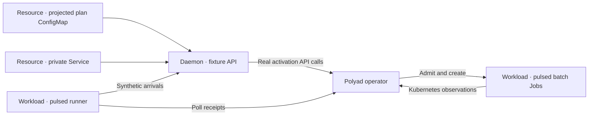

# Load: activation acceptance and completion

<!-- toc:start -->
**Table of contents**

- [Study artifacts](#study-artifacts)
- [Fixture graph](#fixture-graph)
- [Deploy](#deploy)
- [Plans and replica counts](#plans-and-replica-counts)
- [Run identity and correlation](#run-identity-and-correlation)
- [Monitoring and traces](#monitoring-and-traces)
- [Repeat an experiment](#repeat-an-experiment)
- [Read measurements](#read-measurements)
- [Cleanup](#cleanup)
<!-- toc:end -->

Measure how the real operator responds to a bounded stream of activation requests
inside one application Graph. Each request produces an Activation receipt and,
if admitted, a short-lived Kubernetes Job. This study measures control-plane
reconciliation, activation acceptance and Job completion under increasing load.

## Study artifacts

Study-specific deployment and run inputs live in [`fixtures/`](fixtures/):

| Artifact | Purpose |
| --- | --- |
| [application.yaml](fixtures/application.yaml) | Manually synced Argo CD Application for the benchmark chart |
| [gke-values.yaml](fixtures/gke-values.yaml) | Benchmark placement, monitoring and Reloader overlay |
| [operator-values.yaml](fixtures/operator-values.yaml) | Operator metrics, graph diagnostics and tracing overlay |
| [operator-agents-values.yaml](fixtures/operator-agents-values.yaml) | Optional Alloy collection overlay for the operator release |
| [plan.json](fixtures/plan.json) | Client-submitted composition, replica counts and run parameters |
| [scenario.json](fixtures/scenario.json) | Installed fixture selection and refresh execution settings |

Reusable chart templates and test profiles remain in `charts/polyad-benchmarks`.
The refresh runner snapshots `fixtures/scenario.json` and fingerprints all study
inputs. Raw run outputs go under the chosen `.cache/benchmarks/refresh-RUN`
directory; verified published measurements go to `studies/load/results.json`.

## Fixture graph



The Graph's declared connections form a star around the fixture. Its referenced
GraphPolicy requires structural Cheeger expansion of at least 0.5 and bounds expanded
vertices/edges. The batch policy permits two concurrent Jobs and 32 pending pulses.
The runner policy rejects simultaneous runs. Neither Workload starts on install;
only the fixture, discovery Service and plan ConfigMap start automatically. Their definitions
come from the [CRD template chart](../../charts/polyad-crds/README.md).

## Deploy

First provision the [GKE experiment environment](../../terraform/README.md) and
[build/publish both images](../../services/README.md). Install into the operator's
namespace after its CRDs and API are ready:

```sh
helm dependency build charts/polyad-benchmarks
helm upgrade --install benchmarks charts/polyad-benchmarks -n polyad \
  -f studies/load/fixtures/gke-values.yaml \
  --set polyadResources.variables.images.runner=YOUR_REGISTRY/polyad-benchmarks-runner \
  --set polyadResources.variables.images.fixture=YOUR_REGISTRY/polyad-benchmarks-fixture \
  --set polyadResources.variables.images.tag=RUN
```

The GKE overlay puts fixture services and batch consumers on `fixtures`, along
with monitoring and Reloader. Runner Jobs produce load on the separate `copolyad`
pool. Polyad's chart remains on `polyad`; all three pools use the same machine
type but autoscale independently. `polyadResources.variables.placement` controls
consumers, while `runnerPlacement` controls generators. Both require a selector
and the matching dedicated-pool toleration. The client [plan.json](fixtures/plan.json)
uses the same separation. Record node-provisioning time separately for each pool.

Terraform also registers a manual-sync `polyad-benchmarks` Application in its
[standalone Argo CD UI](../../terraform/README.md#inspect-the-benchmark-application).
Choose either that Application or the Helm installation above to own the fixture.
For an existing Argo installation without Terraform registration, use the
[standalone Application example](fixtures/application.yaml). Set its revision and published
image parameters before applying it; do not apply it over Terraform's Application.
Argo owns definitions, while dynamic Jobs and receipts remain operator-owned.
Unrelated syncs do not issue activations.

Both Applications skip shared CRDs. Follow the [monitoring CRD setup](../../terraform/README.md#inspect-the-benchmark-application)
before the first Argo sync. A first Helm install above instead supplies missing
dependency CRDs. Coordinate future CRD upgrades separately; Helm does not upgrade
existing CRDs automatically.

The current private GKE profile disables operator authentication. For a shared
environment set `polyadResources.variables.secretName` to an existing Secret with
`operator-token` and `fixture-token` keys. Grant the operator token activation
access for this graph tree and allow fixture/runner traffic through any Istio
AuthorizationPolicy and NetworkPolicy. No cluster-admin token is mounted in Pods.

## Plans and replica counts

Choose a [test profile](../../charts/polyad-benchmarks/README.md#test-profiles):
[smoke](../../charts/polyad-benchmarks/values-smoke.yaml),
[steady](../../charts/polyad-benchmarks/values-steady.yaml), or
[burst](../../charts/polyad-benchmarks/values-burst.yaml). Each selects its matching
JSON plan under `charts/polyad-benchmarks/plans/`. Add that values file before
the GKE placement overlay in the install command. Smoke remains the default.

The chart merges that plan with explicit `polyadResources.variables` overrides,
then projects the resolved `run` and `replicas` as `plan.json`
in a Graph-owned ConfigMap, mounted at `/etc/polyad-benchmarks/plan.json`. The
runner loads it once when starting and saves that exact snapshot with results.
`replicas.fixture` sets the fixture Deployment's Pod count; `replicas.batch` sets
the batch Workload's maximum concurrent executions. These do not change operator
replicas or bypass the GraphPolicy and activation policies.

Update Helm values between experiments. The GKE overlay enables the Reloader
dependency and `polyadResources.variables.reloadOnPlanChange`. Polyad copies the
Daemon's ConfigMap reload annotation onto its native Deployment. Reloader watches
only the namespace, ignores Jobs, and rolls the fixture after ConfigMap changes.
Do not edit plans mid-run: rollouts can interrupt arrivals, and the refresh rejects
changed definitions. When using an existing Reloader, disable `reloader.enabled`
but retain the fixture opt-in.

A client can instead create an isolated run without Kubernetes write credentials.
Edit [plan.json](fixtures/plan.json), including published images. Generate a
reviewable composition, then reuse its generated ID when submitting it:

```sh
export POLYAD_API_URL=http://YOUR_OPERATOR_API:8080
polyad-benchmarks-plan --plan studies/load/fixtures/plan.json --namespace polyad --render-only > /tmp/load-composition.json
RUN_ID=$(python3 -c 'import json; print(json.load(open("/tmp/load-composition.json"))["requestId"])')
polyad-benchmarks-plan --plan studies/load/fixtures/plan.json --namespace polyad --run-id "$RUN_ID"
```

The first command renders a reviewable composition from the same Helm templates;
the second submits it through `polyad_sdk.Client.compose`. An authorized token
must permit composition and activation in the resulting tree. Each new composition
creates an immutable plan ConfigMap and runs its runner once after dependencies
are ready. `load-envelope` must already exist in the receiving namespace; the
client cannot create or weaken that administrator rule. Track the composition
receipt and collect its runner Job logs. The refresh commands below target the
reusable Helm fixture; they do not automatically collect these separate composed
runs. Delete a completed composition through the client when evidence is saved.

## Run identity and correlation

Every new start or client-plan submission gets a UUID-backed key such as
`load-f4c91743be224b62ba5801dd73ba92b9`. The CLI emits it **before** contacting the
operator, then includes `runId` and `grafanaPath` in the returned receipt. This
makes an uncertain response traceable. Save the receipt and stderr alongside the
run artifacts. Omit `--run-id` for a new experiment; supply the saved ID only to
retry the same intent. An explicit plan `requestId` has the same retry semantics.
The refresh workflow generates an ID during preparation, snapshots it with the
scenario and verifies that collected/published results belong to that ID.

The runner submission uses the run ID as its composition or activation
`requestId`. Arrivals use `RUN_ID-00000`, `RUN_ID-00001`, and so on. Those IDs are
persisted in Activation receipts and injected into Jobs as `POLYAD_ACTIVATION_ID`.
Fixture, runner and batch JSON logs include `runId`; operator receipt decisions
include `polyad.request.id`. HTTP submission/read spans and asynchronous activation
decision spans carry that same request attribute. A run can therefore span many
traces; it is not forced into one long-lived trace.

Open the returned `grafanaPath` on your Grafana host. It fills the dashboard's
**Run ID** and namespace variables; completed results also set the exact time
window. The **Run traces** panel queries Tempo for the run and its numbered
arrivals. In Grafana Explore, an equivalent [TraceQL search](https://grafana.com/docs/tempo/latest/traceql/construct-traceql-queries/)
is:

```traceql
{ span.polyad.request.id =~ "load-f4c91743be224b62ba5801dd73ba92b9(-[0-9]{5})?" }
```

Tracing must be enabled and sampling/retention determine which spans are available.
Aggregate metrics describe the selected namespace and time window, including any
concurrent runs; the run filter applies to traces. Unique IDs are not Prometheus
labels. Search collected logs for the key or inspect the corresponding runner and
batch Pod logs. Grafana log searches require a configured log backend, such as
Loki; the bundled study stack supplies Tempo and Prometheus but no log backend.

`planHash` separately identifies the projected `run` and `replicas` configuration.
The Helm notes show the same SHA-256 hash and resolved settings. Two runs of the
same plan have different run IDs but the same plan hash. Helm notes describe the
prepared fixture and how to submit it; the submission receipt and final runner
result describe the actual run. Retain image and placement snapshots as well when
comparing experiments.

## Monitoring and traces

For metrics from all enabled operator-chart components, use the optional
[Alloy or Prometheus Agent setup](../../docs/operations/telemetry-agents.md#benchmark-deployment).
It includes a benchmark overlay that disables duplicate direct operator scraping.

The GKE overlay enables four optional, pinned chart dependencies: Reloader,
`kube-prometheus-stack` (Prometheus, Grafana and cluster exporters), Tempo for
trace storage, and the OpenTelemetry Collector. All are disabled in the base
chart so an existing monitoring installation can be used. Prometheus retains
seven days on a 10 GiB PVC, Tempo retains 72 hours on 10 GiB, and Grafana has a
5 GiB PVC. These backends run on `fixtures`, away from the Polyad operator and
`copolyad` producers. Adjust storage, retention and placement in the dependency
values, and record their overhead on the consumer pool.

Apply [operator-values.yaml](fixtures/operator-values.yaml) to the operator's existing
Helm/GitOps configuration as an additional overlay. It enables metrics, graph
labels and OTLP/HTTP export to `benchmarks-otel.polyad.svc:4318/v1/traces`; adapt the
namespace when needed. It deliberately samples every operator trace for the study.
The operator overlays enable full [graph diagnostics](../../docs/operations/metrics.md#graph-diagnostics-for-benchmarks),
including retained eigenvalues. The fixture rule requests `spectrum: {}` alongside
its existing Cheeger bound, so spectra are calculated during rule evaluation.
The dashboard separates exact Cheeger from witnessed upper bounds and shows cut
work, budgets, topology dimensions, spectral summaries and application targets.
These measurements describe graph boundaries; they do not imply application
throughput guarantees. Keep graph diagnostics and spectral calculation settings
fixed across comparisons, along with trace sampling. The Collector batches traces into Tempo;
Grafana gets Prometheus and Tempo data sources automatically. This instruments
the operator's existing spans, not every Python statement or fixture request.

A ServiceMonitor selects the operator metrics Service by namespace/release.
Configure `observability.operatorNamespace`, `operatorRelease` and optional
`metricsSecret`/`metricsSecretKey` for another installation or authenticated
scrapes. With an existing stack, leave the dependency disabled and arrange its
ServiceMonitor selector and Grafana sidecar to discover the supplied objects.
The Collector may be enabled independently; point an external Grafana at Tempo
when its bundled Grafana is disabled.

Access Grafana privately:

```sh
kubectl -n polyad port-forward service/benchmarks-grafana 3000:80
kubectl -n polyad get secret benchmarks-grafana -o jsonpath='{.data.admin-password}' | base64 --decode
```

Log in locally as `admin`, then open **Polyad load study**. The runner's result
includes `runId`, `planHash`, `startedAt`, `finishedAt` and a `grafanaPath`
with its exact time range and run filter.
The dashboard covers API arrival rate, reporting replicas, write backlog/age,
inbound updates, graph observations, tracked objects and operator memory. Select
the operator namespace; shared state uses maximums across replicas to avoid
counting the same state repeatedly. Use Grafana Explore's Tempo source for
operator traces within the same interval. Export panel CSV/PNG files and relevant
trace IDs into the run's output directory before retention expires; they remain
study evidence alongside measurements. The refresh archives its JSON/logs
without claiming that screenshots or Prometheus snapshots were automatically taken.

## Repeat an experiment

Install the package with the optional plotting extra on the refresh machine:
`pip install './pkg/polyad-benchmarks[plots]'`. The fixture and runner containers
use the base package. See [package installation](../../pkg/polyad-benchmarks/README.md#install).
Edit [scenario.json](fixtures/scenario.json) for the namespace, graph, fixture selector and
overall deadline. It never contains credentials. Set arrival rate and other
experiment inputs through `polyadResources.variables.run` in the Helm values;
the snapshot includes the Graph, definitions and plan used by the cluster.

Run from the repository root with an explicit kubeconfig context:

```sh
polyad-benchmarks-refresh --ci-phase prepare --root .cache/benchmarks/refresh-RUN
polyad-benchmarks-refresh --ci-phase study --root .cache/benchmarks/refresh-RUN \
  --study load --context YOUR_GKE_CONTEXT
polyad-benchmarks-refresh --ci-phase finish --root .cache/benchmarks/refresh-RUN --publish
```

The study starts the runner by executing its installed CLI inside the ready
fixture Pod, using that Pod's graph-scoped credential. Multiple fixture replicas
are supported; one ready Pod initiates the run and all ready replica identities
are recorded. It polls the resulting
Activation and collects the runner's Job logs. Use a fresh `RUN` directory for
each experiment. A missing fixture, changed source/recipe, changed Graph generation or fixture definition,
failed activation or timeout fails the run and retains diagnostics.

The [Polyad pipeline](../../.github/workflows/ci.yml) calls the reusable
[benchmarks component](../../.github/workflows/benchmarks.yml) with these same
phases. Its manual `full-refresh` input requires an administrator-configured runner
inside the private cluster network, the `benchmarks` environment and an explicit
context. It does not run against the cloud on pull requests.

## Read measurements

Results contain scheduled, submitted and skipped arrivals, per-request phases,
API acceptance latency and completion latency measured from initial submission.
The scheduler does not accumulate an unbounded executor backlog: it skips arrivals
when observation concurrency is exhausted or the generator misses an arrival slot.
Skipped work is reported explicitly, and the runner exits nonzero if any requests
fail, time out, are skipped or are interrupted. These overload observations remain
in raw artifacts; they cannot be published as a fully successful run.

The runner emits JSON to stdout and `/tmp/results.json`. Collect stdout before
another runner activation replaces its completed Job. The refresh saves results,
raw logs, Graph snapshots, definition snapshots, fixture image IDs/node placement,
receipt status, source hashes and timestamps. No cloud results are checked in until
an actual run is performed. `summary.json` retains provenance; `--publish` updates
`studies/load/results.json` only after the whole declared matrix succeeds.

Each completed study also generates `outcomes.png`/`.svg` and
`latencies.png`/`.svg`. The outcome chart shows terminal phases and skipped
arrivals. The latency chart separates API acceptance from successful completion,
with request-order samples and empirical distributions. Failed or timed-out
requests remain in the outcome counts and do not enter successful completion
latencies. Missing timings remain unmeasured.

Figures stay beside raw results in `outputs/load/`; verified publication copies
them to `studies/load/figures/`. The importable renderer is
`polyad_benchmarks.studies.load.plotting`. Use the
[saved-result plotting API](../../pkg/polyad-benchmarks/README.md#optional-study-plots)
to visualize retained results from an unsuccessful run without rerunning cloud work.

Record several runs at each rate. Keep images, processing delay, resource requests
and batch policy fixed while changing operator worker/replica settings. Correlate
results with [per-Pod operator metrics](../../docs/operations/metrics.md), write
queue age, rejected proposals, KEDA desired/ready replicas and node readiness.
Use the [bundled monitoring stack](#monitoring-and-traces) or an existing Prometheus.
Polling itself adds operator read traffic. Acceptance is not completion, sleeping
batches do not model CPU work, and mock transport tests are not cloud benchmarks.

## Cleanup

Export artifacts first, then uninstall the fixture chart:

```sh
helm uninstall benchmarks -n polyad
kubectl -n polyad wait --for=delete graph/load-study --timeout=300s
```

Graph deletion triggers normal operator cleanup of its Jobs, Deployment, Service
and receipts. Monitoring PVCs may remain under their chart retention policies;
remove them explicitly only after exporting evidence. Timeouts or interrupted refreshes do not silently delete evidence or
cancel active work. If Argo installed the fixture, delete its Application/resources
through Argo so it cannot restore the fixture while cleanup is running.
