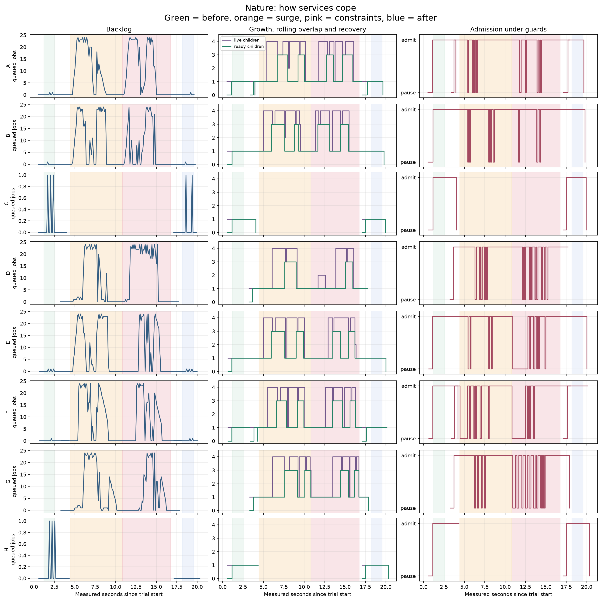
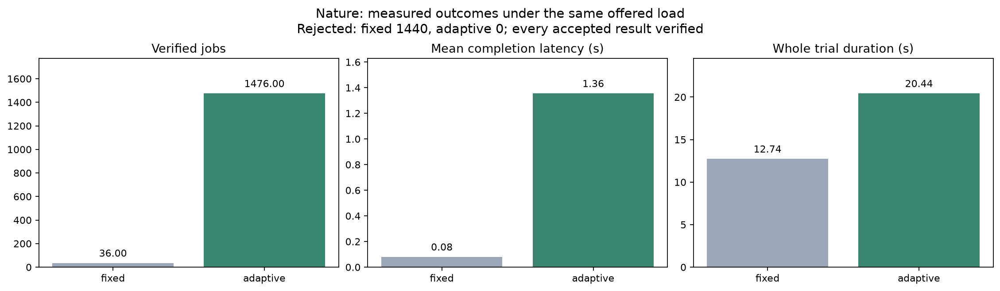
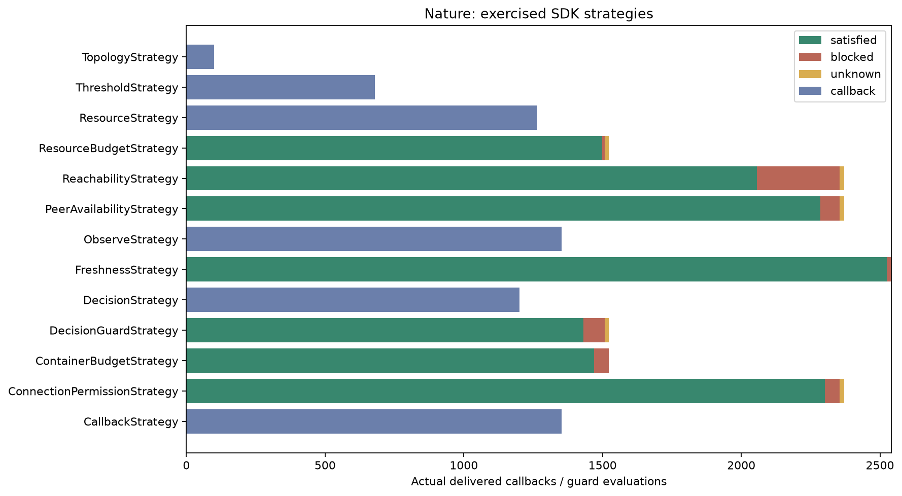

# Nature: composition changes above adaptive services

This study places Natural Selection above the [Soul process study](../soul/README.md).
The parent changes the required result while six services adapt their own workers
and admission policies. Services survive, receive replacement implementations,
join the composition or retire according to whether they can help produce that result.
The original [`nature.py`](../../nature.py) stays unchanged and supplies the planner
and business functions.

## Table of contents

- [Run](#run)
- [Composition changes](#composition-changes)
- [Code and strategies](#code-and-strategies)
- [Measured results](#measured-results)
- [Repeat the experiment](#repeat-the-experiment)

## Run

From the repository root, using Python 3.13 or 3.14:

```sh
pip install ./pkg/polyad-types ./pkg/polyad-sdk './pkg/polyad-benchmarks[nature]'
python -m polyad_benchmarks.studies.nature --output .cache/benchmarks/nature-001
```

Keep the checkout available: the package imports the root demos. Matplotlib is
installed through the optional `nature` extra. Use `process-studies` to install
both studies' requirements. Each trial runs in its own process population and
the monitoring parent aggregates observations and renders PNG/SVG figures after
verified shutdown.

## Composition changes

```text
before: output = x*x        during: output = x*x+1       after: output = x*x

       +-> A(square)               +-> A'(fused)                +-> A''(square)
       +-> B(square)               +-> B(square) -> D(+1)      +-> B(square)
router +-> C(square)        router |                     router +-> C(square)
       +-> E(square)               +-> E(square) -> G(+1)      +-> E(square)
       +-> F(square)               +-> F'(fused)                +-> F''(square)
       +-> H(square)                                           +-> H(square)

Every selected service owns its own adapting worker tree.
```

An apostrophe means a new process with a different capability. A fused capability
computes the square and adds one in a single service. The two-stage routes square
the value in one service and add one in another. Both produce the exact same
required result, which the parent verifies for every job.

The initial contract requires six square routes with a total declared cost of at
most seven. The changed contract requires four enriched routes at cost at most
six. C has cost two; other placements cost one. The planner searches the expanded
catalog under a six-service limit and a ten-service rolling-overlap limit.

- A and F change implementation through ready replacements.
- B and E keep their process identities and supply useful square stages.
- D and G start to provide the increment stages.
- C and H retire after their accepted jobs finish.
- Restoring the original contract brings back six square routes and retires the
  increment services.

Within each selected service, the same [SDK strategies](../soul/README.md#strategy-modules)
handle high queues, modeled memory reservations, unavailable observations,
intermittent peer health, pending/expired permission and decision stabilization.
Composition changes happen between drained phases. Local worker replacements
happen while accepted work continues through the service.

## Code and strategies

The code corresponds directly to this study directory:

```text
pkg/polyad-benchmarks/polyad_benchmarks/studies/nature/
    monitor.py                     parent composition policy and observation owner
    capabilities/                  declared implementations and their costs
    selection/                     call the original Natural Selection planner

pkg/polyad-benchmarks/polyad_benchmarks/studies/soul/
    runtime/                       shared routing, lifecycle and service process loop
    strategies/                    SDK policy components inside every service
    plotting.py                    parent-side measurement plots
```

Start with [`monitor.py`](../../pkg/polyad-benchmarks/polyad_benchmarks/studies/nature/monitor.py)
and [`selection`](../../pkg/polyad-benchmarks/polyad_benchmarks/studies/nature/selection/__init__.py).
The adapter temporarily supplies the study's expanded catalog to the original
planner during a serialized call and restores it in `finally`. The worker
implementations and root scripts are shared rather than copied.

The parent retains job ownership through every route stage. It prepares service
replacements, waits for ready workers, commits compatible routes, then drains and
joins excluded services. Local worker guards are rechecked before creation and
before committing a ready replacement. All processes are bounded and owned by a
parent that cleans them up on success or failure.

## Measured results








The fixed trial keeps the initial square implementations. When the contract asks
for square-plus-one, it explicitly rejects those jobs instead of returning the
wrong answer. The adaptive trial can satisfy both contracts. Compare completion
and rejection counts first: mean latency covers completed jobs only, so the fixed
trial's latency does not represent equivalent work during the changed contract.

The three topology panels contain actual service and worker PIDs. The timeline
includes old and replacement generations under each logical service name. Raw
records retain the individual PIDs, lifecycle events and job completion times.
Lines stop when a process stops reporting and resume with its replacement, so
retired services leave gaps rather than appearing active throughout the change.
Memory pressure and connectivity disturbances are controlled inputs; timing,
queues, process lifecycle and returned values are measured.

## Repeat the experiment

The [recipe](fixtures/scenario.json) uses the same offered arrivals as Soul and
changes `output` to `enriched` during surge and constraints. The reference and
adaptive trials each receive 1,476 offered jobs with the default recipe.
Every phase drains and returns its remaining services to interactive workers.

Use the [shared refresh commands](../soul/README.md#refresh-and-evidence) to capture
inputs once, run each study independently and verify the whole matrix before
publishing. The [published result](results.json) retains provenance and measured
outcomes. Full records live in `outputs/nature/` in the run directory or the
**Process studies** CI artifact. Changing the recipe can change which strategies
activate; inspect the coverage plot and lifecycle events alongside the outcomes.
