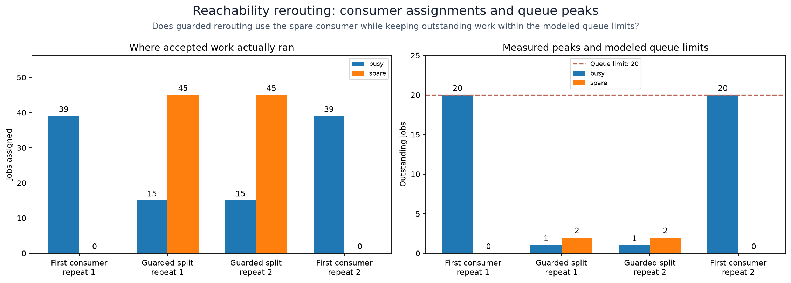
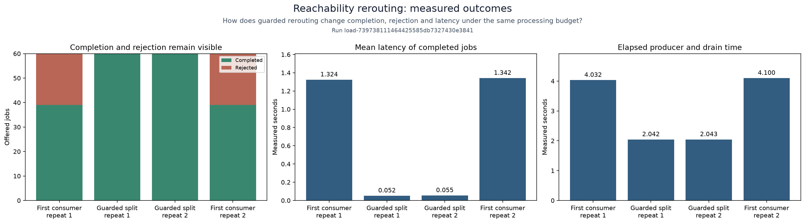

# Reachability: predicted and measured rerouting

<!-- toc:start -->
**Table of contents**

- [Process experiment](#process-experiment)
- [Run](#run)
- [Read the evidence](#read-the-evidence)
<!-- toc:end -->

Exercise the SDK queue guard with one producer process and two consumer
processes. Compare sending everything to the first consumer with an approved
25/75 split that uses the second consumer's spare capacity. The workload and
number of consumer processes stay fixed.

## Process experiment

[`fixtures/scenario.json`](fixtures/scenario.json) sets 60 jobs at 30 jobs/s,
consumer capacities of 10 and 35 jobs/s, and 20-job outstanding-work limits.
Each consumer checks an integer's square after a service delay. A coordinator
owns routing, retains job identities until verified completion and records
explicit rejections when admission is unavailable. Bounded multiprocessing
channels carry the actual jobs and results.

The baseline sends to the first consumer and enforces its queue limit. It records
the guard's prediction without using it to alter the baseline. The guarded
variant evaluates `ReachabilityStrategy` before admitting each job and applies
the approved weighted split. Both verify every accepted result and drain and
join all processes. A failed or timed-out run terminates its process tree.

Two repetitions alternate execution order. The same queue models first predict
whether each route can avoid overflow under the bounded fluid arrival rate.
The process experiment measures the difference introduced by discrete jobs,
scheduling and messaging. It builds on the [Soul example](../../docs/workloads/local-soul-searching.md)
with a controlled two-consumer experiment rather than changing that demo's protocol.

## Run

Use the [local suite refresh commands](../symbiosis/README.md#run), selecting
`--study reachability-routing` for this study phase. Its execution code lives in
`polyad_benchmarks.routing_study`; recipe changes are fingerprinted at preparation.
This experiment itself uses the standard-library analytic guard and real processes;
the other suite members add optional HJ comparisons.
Plotting uses the optional `plots` extra, also included in `reachability`.
The `polyad_benchmarks.studies.reachability_routing.plotting` module produces
`routing` and `outcomes` as PNG/SVG figures, published under `figures/`.

## Read the evidence

The [recorded results](results.json) retain each paired repetition and its source
fingerprints. The plots keep every repetition separate so scheduling differences
and rejections remain visible.

Compare completion and rejection counts before interpreting latency: the mean
covers completed jobs only. Queue limits and assignment counts show whether the
second consumer's capacity was used.

Each record includes the predicted result, exact envelope artifact, route counts,
actual completions and rejections, maximum outstanding work per consumer, elapsed
time, mean completion latency, guard assessments and `allJoined` cleanup evidence.
The invariant is `offered = completed + rejected`, with every accepted work ID
accounted for exactly once in this local experiment.

The baseline's refusal to accept excess work demonstrates bounded admission.
Compare its rejected count and latency with the admitted split. A guard can also
reject work when scheduling delays consume modeled headroom; keep those outcomes
visible. Report disagreement between the fluid assumptions and process behavior.
This study measures local runtime behavior, not Kubernetes deployment latency or
a durable distributed delivery protocol.
