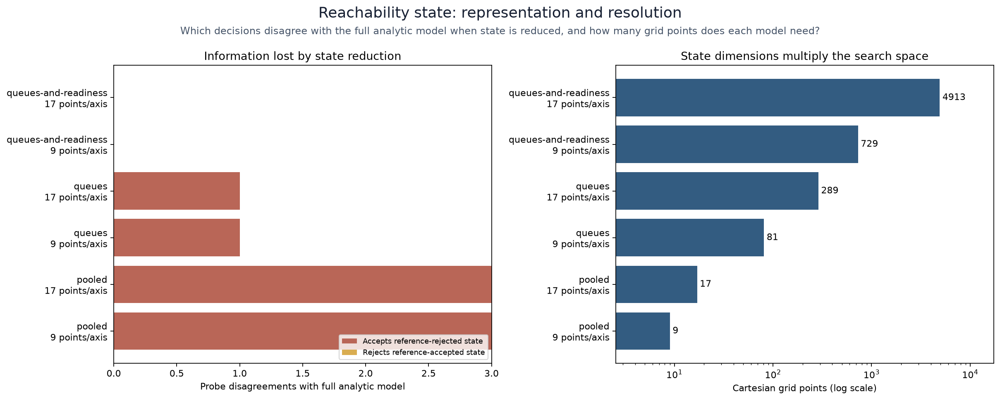
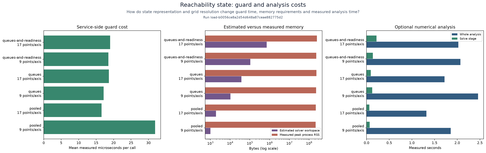

# Reachability: selecting state variables

Measure the cost and consequence of describing the same service pair with one,
two or three state variables. A smaller model may hide a busy consumer or a
consumer that has not become ready.

## Table of contents

- [Representations](#representations)
- [Run](#run)
- [Interpret results](#interpret-results)

## Representations

[`fixtures/scenario.json`](fixtures/scenario.json) declares two consumer queues,
their fixed traffic split, capacities, queue limits and remaining readiness time.
The reference is the three-variable fluid model. The study projects each
observation into these representations:

| Representation | State | Assumption under examination |
| --- | --- | --- |
| Pooled | Total queued work | All processing capacity can serve every queued item immediately |
| Separate queues | Each consumer's queued work | Both consumers are already ready |
| Queues and readiness | Both queues plus remaining warmup seconds | The second consumer starts processing only after readiness |

Each representation is evaluated at the same declared horizon. Numerical
resolution is swept independently over `resolutions`; dimension and resolution
remain separate recorded variables. Configure arrival bounds and observations
to investigate other demand patterns. Modify recipes before preparing a run.

## Run

Use the [local suite refresh commands](../symbiosis/README.md#run), selecting
`--study reachability-state` for this study phase. Its implementation is
`polyad_benchmarks.reachability.state_variables`. All artifacts and publication
checks use the shared refresh protocol.
The importable `polyad_benchmarks.studies.reachability_state.plotting` module
generates `state-tradeoffs` and `analysis-cost` as PNG/SVG figures. Matplotlib is
included in the `reachability` extra; use `plots` for saved results without the
numerical backend.

## Interpret results

The [recorded results](results.json) retain every representation and
resolution. The pooled model accepted three reference-rejected observations;
dropping readiness accepted one. The full model is the comparison baseline.

The memory panel separates estimated workspace from actual peak process RSS,
which includes imports and runtime overhead. Disabled numerical analysis leaves
the solver timing panel explicitly unmeasured.

`optimisticCount` counts observations accepted by a reduced analytic model and
rejected by the full analytic model. `conservativeCount` counts the reverse.
These comparisons measure information lost through projection; the full model
is a stated reference, not observed production truth. The
[real-process study](../reachability-routing/README.md) supplies a separate
comparison against actual execution.

Results include all observations and projections, model fingerprints through
numerical results, grid points, workspace estimates, actual peak RSS, compilation
and solve time, and runtime guard cost. Reducing dimensions is useful only when
the remaining state preserves the constraints that matter. Shared-resource
coupling must be represented or bounded when extending these models.
