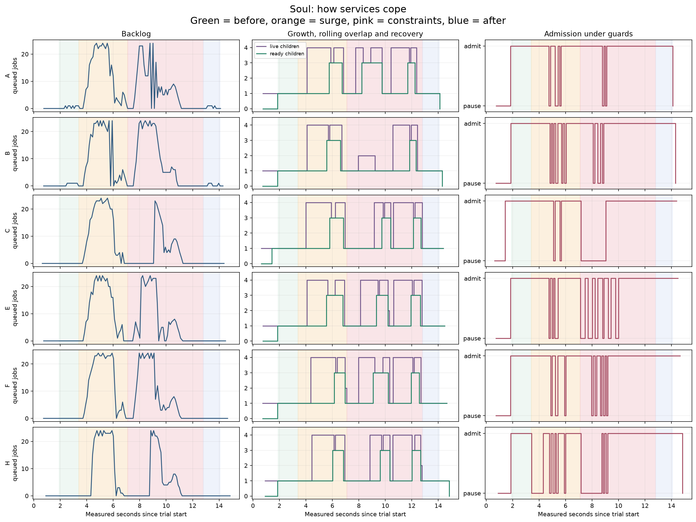
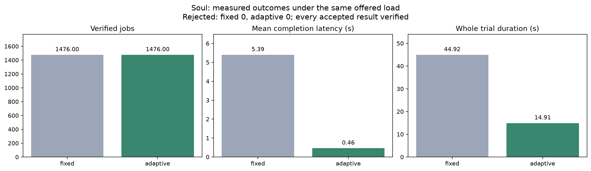
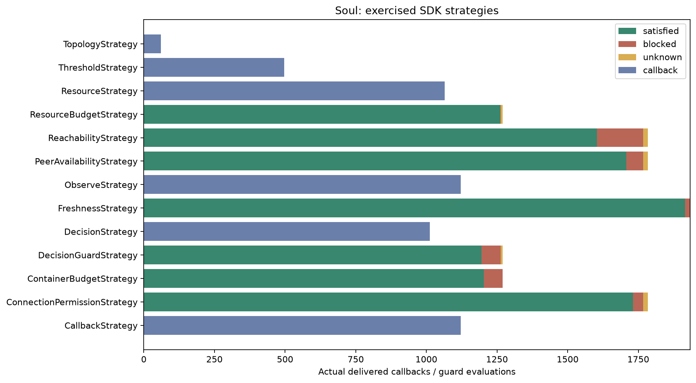

# Soul: a population adapting under constraints

This study runs six application services, their child workers, a producer and a
monitoring parent. It exercises the SDK's concrete strategy implementations
together, then plots the actual process trees, queues, admission decisions and
completed work. The original [`soul.py`](../../soul.py) remains the smaller TCP
work-sharing example.

## Table of contents

- [Run](#run)
- [Process tree and phases](#process-tree-and-phases)
- [Strategy modules](#strategy-modules)
- [Read the results](#read-the-results)
- [Refresh and evidence](#refresh-and-evidence)

## Run

Use Python 3.13 or 3.14 from the repository root. The study imports the existing
root demos, so keep this checkout available when running it.

```sh
pip install ./pkg/polyad-types ./pkg/polyad-sdk './pkg/polyad-benchmarks[soul]'
python -m polyad_benchmarks.studies.soul --output .cache/benchmarks/soul-001
```

The optional `soul` extra installs Matplotlib. `nature` installs the other study's
plotting requirements; `process-studies` installs the requirements for both.
The normal benchmarks commands do not import Matplotlib or start study processes.

The parent runs a fixed reference trial followed by an adaptive trial, each with
fresh processes and the same [recipe](fixtures/scenario.json). Both verify every
accepted job and drain and join their descendants. Interruptions and failed
assertions invoke process cleanup; logs remain in the run directory.

## Process tree and phases

```text
producer -> parent: routes jobs, verifies results, records measurements
              +-> A -> worker(s)
              +-> B -> worker(s)
              +-> C -> worker(s)
              +-> E -> worker(s)
              +-> F -> worker(s)
              +-> H -> worker(s)

before                 load                         recovery
service -> 1 worker    service -> 3 batch workers    service -> 1 worker
                             -> 1 compact worker when memory is reserved
```

These are real processes communicating through multiprocessing pipes. The parent
relays the service routes; the root demo demonstrates direct TCP peer connections.
A worker computes the square of each job's input and sleeps once per batch to
represent an I/O operation. Batching therefore amortizes this simulated I/O cost.

| Phase | Offered work | Environment and response |
| --- | --- | --- |
| Before | 18 jobs/s for one second | Six square services, one interactive child each |
| Surge | 240 jobs/s for three seconds | Queue thresholds propose three batch workers; one service waits for an applied decision, another for connection approval |
| Constraints | 240 jobs/s for three seconds | Separate services face memory reservation pressure, unavailable observations, intermittent peer health and expired connection permission |
| After | 18 jobs/s for one second | Restore fresh observations and permissions; finish accepted work and return to one interactive child per service |

Each phase drains before the next begins. Its recorded duration includes draining
and recovery. Each service accepts at most 24 outstanding jobs and owns at most
four workers during rolling overlap. The parent holds at most 128 waiting stages;
pipe backpressure slows the producer when that queue fills. Worker startup and
readiness, profile commits, retirement and joins are all measured.

The adaptive router assigns future jobs to an admitting service with the fewest
outstanding jobs. The reference router keeps a skewed assignment that gives A
half the jobs. Both retain job identities and check every returned square. Both
enforce admission guards; the reference retains its original worker profile.

## Strategy modules

Read [`monitor.py`](../../pkg/polyad-benchmarks/polyad_benchmarks/studies/soul/monitor.py),
then [`runtime/engine.py`](../../pkg/polyad-benchmarks/polyad_benchmarks/studies/soul/runtime/engine.py)
for parent ownership and [`runtime/service.py`](../../pkg/polyad-benchmarks/polyad_benchmarks/studies/soul/runtime/service.py)
for the application loop. [`runtime/policy.py`](../../pkg/polyad-benchmarks/polyad_benchmarks/studies/soul/runtime/policy.py)
extends `AdaptiveService` and installs every strategy before startup.

All module paths below are relative to
[`polyad_benchmarks/studies/soul/strategies`](../../pkg/polyad-benchmarks/polyad_benchmarks/studies/soul/strategies/).
The [SDK strategy guide](../../docs/workloads/adaptation-strategies.md) defines
these interfaces and the [Kubernetes guide](../../docs/workloads/kubernetes-adaptation.md)
relates them to production events.

| SDK strategy | Module | What the application does with it |
| --- | --- | --- |
| `ObserveStrategy` | `observation/logging.py` | Observe SDK deliveries through the standard logging callback |
| `CallbackStrategy` | `observation/callbacks.py` | Count meaningful changes between snapshots |
| `TopologyStrategy` | `routing/topology.py` | Refresh usable child identities after worker generations change |
| `PeerAvailabilityStrategy` | `routing/peers.py` | Pause new assignments during injected health failures |
| `ConnectionPermissionStrategy` | `routing/connections.py` | Wait for an active receipt and stop admission on expiry |
| `ResourceStrategy` | `capacity/resources.py` | Propose the compact profile under reservation pressure |
| `ContainerBudgetStrategy` | `capacity/memory.py` | Defer replacement when its modeled memory reservation would exceed capacity |
| `ResourceBudgetStrategy` | `capacity/budget.py` | Check that current plus proposed workers fit the overlap ceiling |
| `ThresholdStrategy` | `capacity/threshold.py` | Propose batch workers above eight queued jobs and interactive workers below two |
| `DecisionStrategy` | `decisions/observations.py` | Observe the operator decision phase |
| `DecisionGuardStrategy` | `decisions/guard.py` | Defer a worker change until that decision is applied |
| `FreshnessStrategy` | `freshness/` | Hold admission and profile changes when a topology read fails |
| `ReachabilityStrategy` | `reachability/` | Check whether admitting the next job remains inside the queue envelope |

The guard's analytic model has one state variable: outstanding jobs. Its ceiling
is 24, horizon one second and assumed further arrivals and service are both zero.
The tested state includes the proposed next job. This demonstrates a conservative
single-admission check; the [reachability studies](../reachability-state/README.md)
exercise demand uncertainty and richer dynamics. No JAX solver runs in this study.

Memory inputs are modeled reservations used to exercise the SDK's budget guard;
they are not measurements of Python RSS. Queue sizes, worker counts, process IDs,
results and timings are measured. Use real container usage in application code.
An unavailable path stops new assignments while already accepted work drains.

## Read the results


Purple dots are actual child processes, with their PIDs. Gray children are
retiring. Service boxes turn pink while new assignments are paused. Compare child
identities across panels to see replacement, even when the final worker count
returns to one. The middle panel selects a recorded frame with worker overlap
and blocked admission; the timelines show the complete experiment.







The comparison measures the combined effect of routing and worker adaptation.
Both runs use the same ceilings, but the adaptive trial may use more workers.
Read latency alongside completed work and trial duration. Process startup,
operating-system scheduling and the I/O delay influence the result. Repeat runs
to estimate variability before changing a production policy.

## Refresh and evidence

Edit the versioned recipe before preparation. It sets phase duration, arrival
rate, per-batch delay and lifecycle timeout. Validation rejects nonfinite values
and enforces finite study ceilings. Small or low-load recipes may exercise fewer
strategy transitions; the recorded coverage makes this visible.

To refresh both studies and their published figures:

```sh
pip install './pkg/polyad-benchmarks[process-studies]'
polyad-benchmarks-refresh --ci-phase prepare --suite process --root .cache/benchmarks/process-001
polyad-benchmarks-refresh --ci-phase study --study soul --root .cache/benchmarks/process-001
polyad-benchmarks-refresh --ci-phase study --study nature --root .cache/benchmarks/process-001
polyad-benchmarks-refresh --ci-phase finish --root .cache/benchmarks/process-001 --publish
```

Preparation assigns a run ID and fingerprints source code, root demos and recipes.
Finish checks those inputs, both trials' job accounting, clean shutdown and every
raw-result/figure checksum before publication. The compact [published result](results.json)
retains outcomes, lifecycle decisions and provenance. Full job ledgers, sampled
graph frames and measurements remain in `outputs/soul/{fixed,adaptive}.json`, with
PNG and SVG figures beside them. Preserve the run directory or CI artifact.

The **Process studies** workflow tests the harness on Python 3.13 and 3.14, runs
Soul and Nature as separate matrix jobs and retains measurements even on failure.
