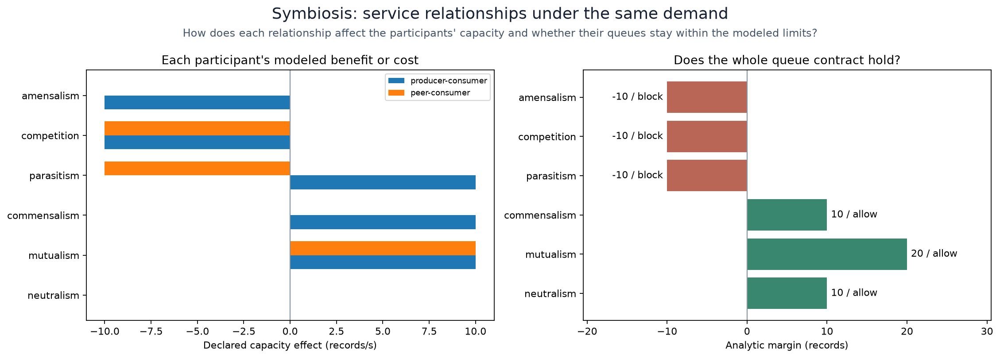
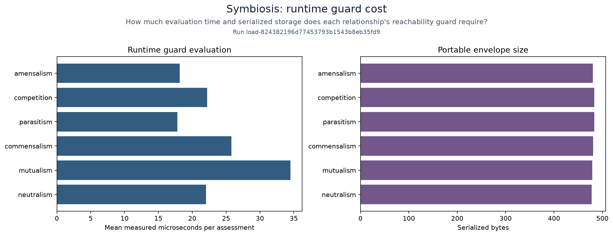

# Symbiosis: costs and benefits of service relationships

Compare six explicit interaction models under identical demand, routing and
queue budgets. Measure when helping one participant reduces the other service's
ability to satisfy its contract. The effects are configured capacity bounds,
not inferred biological behavior.

## Table of contents

- [Recipe](#recipe)
- [Run](#run)
- [Measurements](#measurements)

## Recipe

[`fixtures/scenario.json`](fixtures/scenario.json) defines baseline capacities,
arrival bounds, initial queues and positive/negative capacity effects for
neutralism, mutualism, commensalism, parasitism, competition and amensalism.
Edit this file before preparation. `numerical` selects real HJ computations;
setting it false retains analytic checks and guard timing only.

Execution lives in `polyad_benchmarks.reachability.interactions`. Each comparison
uses the [SDK models](../../docs/workloads/reachability.md), a two-second horizon
and the same work unit. The peer capacity cost remains visible in the result.

## Run

From the repository root:

```sh
pip install ./pkg/polyad-types ./pkg/polyad-sdk './pkg/polyad-benchmarks[reachability]'
polyad-benchmarks-refresh --ci-phase prepare --suite reachability --root .cache/benchmarks/symbiosis-run-1
polyad-benchmarks-refresh --ci-phase study --study symbiosis --root .cache/benchmarks/symbiosis-run-1
polyad-benchmarks-refresh --ci-phase study --study reachability-state --root .cache/benchmarks/symbiosis-run-1
polyad-benchmarks-refresh --ci-phase study --study reachability-routing --root .cache/benchmarks/symbiosis-run-1
polyad-benchmarks-refresh --ci-phase finish --root .cache/benchmarks/symbiosis-run-1 --publish
```

Use a fresh run directory. Preparation records input and source hashes and gives
each study a run ID. The reachability suite needs no cluster or Kubernetes credentials.
Finish validates all three selected studies before publication; failed runs
remain under the chosen directory for inspection.
The `reachability` extra includes Matplotlib. The study generates `interactions`
and `guard-cost` in PNG/SVG form; verified publication copies them into `figures/`.
Its importable plotter is `polyad_benchmarks.studies.symbiosis.plotting`.

## Measurements

The [recorded results](results.json) include the complete reachability suite and
its source/input fingerprints. Keep new refresh directories to compare later runs.



The first panel keeps each participant's capacity effect visible. The second
shows whether the combined queue contract holds at the initial state and horizon.
A benefit to one service can coincide with a blocked overall contract.



Results record model fingerprints, analytic queue slack, numerical margins at
the initial state, grid size, solver versions, peak RSS, import/solve time,
serialized guard-artifact bytes and mean guard evaluation time. Numerical values
are approximation evidence; runtime admission uses the analytic bound for these
supported models. Inspect both participants, particularly in parasitic cases.

Compare repeated measurements on the same machine and interpreter. Process RSS
includes the numerical runtime and imports. Small grids often spend more time
starting and compiling than solving; the service guard avoids those costs.
