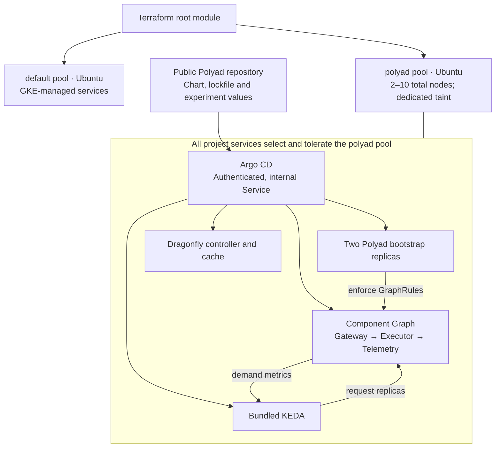

# GKE environment for Polyad scaling experiments

Create an isolated GKE cluster, install Argo CD, and let it sync Polyad from this
public repository. This is the foundation for future load tests of
[the operator's own Graph](../README.md#the-operator-as-a-graph): it provisions
the services and exposes their scaling signals. Install the separate
[benchmark fixture chart and load study](../studies/load/README.md) to generate
repeatable activation traffic. Metrics retention/dashboard infrastructure is
supplied separately.

## Table of contents

- [What runs](#what-runs)
- [Create the environment](#create-the-environment)
- [Observe scaling](#observe-scaling)
- [Run repeatable experiments](#run-repeatable-experiments)
- [Configuration](#configuration)
- [Ownership and teardown](#ownership-and-teardown)
- [Validate without a cloud account](#validate-without-a-cloud-account)

## What runs

The root module calls [`modules/gke`](modules/gke/README.md). That module creates
a dedicated VPC, a **zonal GKE Standard cluster**, and two Ubuntu pools:

| Pool | Capacity | Placement |
| --- | --- | --- |
| `default` | One fixed `e2-highcpu-2` node; configurable with `default_node_count` | Untainted, for GKE-managed services |
| `polyad` | Two initial `c3-standard-4` nodes; autoscaling **2–10 total** | Tainted `dedicated=polyad:NoSchedule`, for the experiment |

Both use `UBUNTU_CONTAINERD`. Polyad, its generated component Daemons, KEDA,
Dragonfly's controller and cache, and all Argo CD components require
`cloud.google.com/gke-nodepool: polyad` and tolerate the dedicated taint. The
selector keeps these services off the default pool; the taint keeps ordinary
system workloads off the experiment pool. GKE agents that must run on each node
can still tolerate taints, so measure their overhead rather than assuming zero
system activity on Polyad nodes.

The **2–10 range applies only to `polyad`**: with the default one system node,
steady-state cluster capacity is 3–11 nodes. Node auto-provisioning is disabled.
Polyad pool upgrades have no surge nodes and may take one node unavailable.
The untainted default pool retains GKE's normal surge upgrade behavior.

Terraform installs Argo CD chart **10.9.2**, running Argo CD **v3.5.3**: the latest
published chart verified on September 17, 2026. The explicit version makes the
environment reproducible; `argocd_chart_version` allows a deliberate upgrade.
See the [upstream chart release](https://github.com/argoproj/argo-helm/releases/tag/argo-cd-10.9.2).

The `polyad` Application follows `https://github.com/astrivant/polyad.git`,
revision `main`, path `charts/polyad`. Terraform registers that public Git source
and the Argo, KEDA, Istio, Dragonfly OCI, Stakater, Prometheus Community,
Grafana Community and OpenTelemetry Helm repositories. The operator and benchmark
charts use their committed `Chart.lock` files; remote optional dependencies are registered
even when disabled. Local `file://` dependencies, including `polyad-crds`, come
from the Git checkout and need no Argo repository entry. No Git credentials are
needed. Polyad's existing
[Argo graph health checks](../docs/operations/argocd.md) are installed too.

The Git-backed [test values](polyad-values.yaml) enable two bootstrap replicas,
the gateway/executor/telemetry component Graph, bundled KEDA, Dragonfly, and
per-graph metrics. Each component starts at two copies and can reach eight,
subject to fresh GraphRules. The component Graph retains its structural Cheeger
minimum of `1` and recursive vertex budget of `27`. The bootstrap count is fixed;
its optional CPU/memory HPA can be enabled for a separate experiment.



This single-cluster baseline uses the component Graph without enabling root
federation or remote workers. The
[atlas/root control plane](../docs/deployment/root-control-plane.md) is a later
experiment with additional credentials and clusters.

## Create the environment

Install Terraform **1.9+**, Google Cloud CLI, `gke-gcloud-auth-plugin`, `kubectl`
and the Argo CD CLI. Use a billing-enabled Google Cloud project with sufficient
CPU and disk quota for ten experiment nodes plus the default system pool. The provisioning identity needs permission to
enable APIs, create GKE/network/service-account resources, and grant the node
service account its project role. Authenticate with Application Default Credentials:

```sh
gcloud auth application-default login
gcloud auth application-default set-quota-project YOUR_PROJECT_ID
cd terraform
cp terraform.tfvars.example terraform.tfvars
```

Edit `terraform.tfvars` with your project and desired zone. Generate a bcrypt
hash of your chosen **admin** password; `admin` is Argo CD's built-in
administrative username, rather than `root`. In Bash, read the password without
echoing it and pass it to the local hash command:

```bash
read -r -s -p 'Argo CD admin password: ' polyad_admin_password
export TF_VAR_argocd_admin_password_hash="$(argocd account bcrypt --password "$polyad_admin_password")"
unset polyad_admin_password
terraform init
terraform plan -out=environment.tfplan
terraform apply environment.tfplan
```

Retain that hash in your password manager for future Terraform runs. Generating
a new bcrypt hash on each run changes the configuration even for the same
password. To rotate it, supply the new hash and advance
`argocd_admin_password_mtime` before applying. Terraform marks the input sensitive,
but its state, plan and Helm release records contain the hash: keep those private.
Local state, plans and `.tfvars` files are ignored by Git; use an access-controlled
remote backend if multiple administrators will operate this environment.

**Publish this Terraform profile to the selected Git revision before applying.**
Argo fetches chart and values files from Git, not your working tree. A local edit
cannot sync until that commit exists in the public repository.

After apply:

```sh
terraform output -raw get_credentials_command
# Run the printed gcloud command, then:
kubectl -n argocd get application polyad
kubectl -n argocd port-forward service/argocd-server 8080:443
```

Open `https://localhost:8080`, accept this test installation's self-signed
certificate, and sign in as `admin` with your password. Argo CD retries sync while
dependency CRDs and admission webhooks become available. Terraform waits for
Argo CD, then creates the Application; a successful apply does **not** mean the
asynchronously synced Polyad application is already healthy. Check the Application
conditions and resource tree before testing.

Argo CD and Polyad use ClusterIP Services; no public ingress or load balancer is
created. The GKE control-plane endpoint and nodes use public IPs for straightforward
test access and image downloads. Pods use Workload Identity, not the node's cloud
credentials. Polyad's test profile explicitly disables HTTP authentication and
request quotas on its **internal** APIs to avoid introducing those limits into
the initial experiment. For a shared cluster, replace that policy with
[authenticated API keys](../docs/operations/api-keys.md) and network restrictions.

## Observe scaling

Once the Application is healthy, observe the different layers separately:

```sh
kubectl -n polyad get graphs,replicagroups,scaledobjects,hpa
kubectl -n polyad get pods -w
# In another terminal:
kubectl get nodes -L cloud.google.com/gke-nodepool -w
```

For metrics, use another port-forward:

```sh
kubectl -n polyad port-forward service/polyad-polyad-metrics 8092:8092
# In another terminal:
curl --fail http://localhost:8092/metrics
curl --fail http://localhost:8092/v1/metrics
```

Record request arrival rate, concurrency, reconciliation backlog, write queue
depth/conflicts, graph observations, requested versus admitted replicas, Pod
readiness and node count. The [metrics inventory](../docs/operations/metrics.md)
defines these signals and freshness indicators. For example,
`polyad_inbound_updates` and `polyad_kubernetes_writes_queued` separate incoming
reconciliation demand from Kubernetes write pressure. Metrics are live snapshots;
scrape them into your chosen time-series store before sustained tests.

KEDA requests more component copies based on their demand signals. Polyad admits
those changes through graph constraints. GKE adds nodes when Pods cannot be
scheduled with the available requested resources; high request rate alone does
not increase node count. A component can hit its eight-copy bound, a GraphRule
can deny growth, or the pool can hit ten nodes. Measure each limit separately.
The [performance guide](../docs/operations/performance.md) covers polling and
stabilization delays; the [Cheeger guide](../docs/graphs/cheeger-orchestration.md)
separates structural guarantees from application throughput targets.

## Run repeatable experiments

Use `main` for ongoing development, then pin `polyad_revision` to a published
commit SHA for each measured run. Save the revision, image digest, values,
machine type and GKE version alongside the results. The Regular release channel
can upgrade Kubernetes independently; record the actual cluster version.

Chart sync does **not** build or publish Python changes. The Application inherits
the image in that Git revision's chart (`ghcr.io/astrivant/polyad` by default).
Ensure it is published and matches the code being measured. The current CI builds
and tests images without publishing them. To test a new image, follow the
[Buildx build/push instructions](../docs/deployment/containers.md), then set its
repository and immutable tag in `polyad_values_override`, or commit those values
to your experiment profile. Argo does not watch image registries for new tags.

Experiment overrides are merged after `polyad_values_files`. For example:

```hcl
polyad_revision = "YOUR_PUBLISHED_COMMIT_SHA"
polyad_values_override = <<-YAML
  architecture:
    components:
      executor:
        backlog: 4
  operator:
    writeQueue:
      reconciliationWorkers: 2
      validationWorkers: 2
      plannerParallelism: 2
      maxInFlight: 2
YAML
```

Start with the default serial write settings, then compare worker counts and
replica bounds while holding workload shape and offered load constant. See
[write pipeline tuning](../docs/development/write-pipeline.md) and
[component scaling](../docs/deployment/components.md). Turning on traffic
balancing, cache HA, PostgreSQL or additional tracing changes the experiment;
their [typed chart references](../charts/polyad/README.md) expose those choices.
Apply the same selector and toleration to optional services and any future load
generator/workload Pods that should consume the experiment pool; arbitrary user
workloads do not inherit the operator's own placement.

## Configuration

All Terraform inputs have explicit types and descriptions in
[`variables.tf`](variables.tf). Key defaults:

| Input | Type | Default / purpose |
| --- | --- | --- |
| `project_id` | string | Required existing project |
| `region`, `zone` | string | `us-central1`, `us-central1-a` |
| `cluster_name` | string | `polyad-load-test` |
| `machine_type` | string | `c3-standard-4` for the Polyad pool |
| `default_node_count` | number (integer) | `1` untainted system node, additional to Polyad capacity |
| `deletion_protection` | bool | `false` for disposable tests |
| `argocd_chart_version` | string | `10.9.2` |
| `argocd_admin_password_hash` | sensitive string | Required bcrypt hash |
| `argocd_admin_password_mtime` | string | Stable RFC3339 rotation timestamp |
| `polyad_revision` | string | `main`; use a commit for reproducibility |
| `polyad_values_files` | list(string) | `../../terraform/polyad-values.yaml`, relative to `charts/polyad` in Git |
| `polyad_values_override` | string | Final YAML mapping, initially `{}`; no secrets |
| `polyad_automated_sync` | bool | `true`; sync, prune and self-heal |

The `polyad` pool's requested **2–10 total** range is fixed in the GKE module;
`default_node_count` controls additional untainted system capacity.
Application namespaces are `argocd` and `polyad`. Chart repositories are derived
from both charts’ local `Chart.yaml` files; apply Terraform again when new dependency
repositories are added upstream. Provider selections are committed in
`.terraform.lock.hcl`; use `terraform init -upgrade` only for an intentional update.

After updating providers, refresh the lock file for both Linux CI and Apple
Silicon development before committing it:

```sh
terraform -chdir=terraform providers lock \
  -platform=linux_amd64 \
  -platform=darwin_arm64
```

This verifies the published provider packages and records content hashes for both
platforms. CI uses `init -lockfile=readonly`, so it cannot add a missing Linux
content hash before `validate` checks the unpacked providers. Archive checksums
alone do not cover that check. Keep the provider versions and checksum checks
intact when fixing this mismatch; the command above adds platform coverage
without upgrading providers. Add further `-platform` arguments for other
developer platforms. See [Terraform's provider locking command](https://developer.hashicorp.com/terraform/cli/commands/providers/lock).

## Ownership and teardown

Terraform owns GKE, Argo CD, repository configuration, health customizations, the
AppProject and Application. Argo owns Polyad's chart resources. Polyad owns the
component instances it creates; KEDA owns the requested replica counts of their
three definitions. Argo ignores those count fields and respects that exception
during sync, so self-healing cannot reset a scaled group to its initial two copies.
GraphRules, min/max counts, templates and images remain Git-managed. The bootstrap
also accommodates the optional Dragonfly scaler and bootstrap HPA.

Use the Application's pruning review when removing resources. If you disable a
scaler and want Git to manage its count again, remove the corresponding
`ignoreDifferences` entry in the bootstrap chart. Argo tracks resources by its own
annotation rather than altering application instance labels used by selectors.

For a disposable run, remove any external resources created by your test workload,
save results, and run:

```sh
terraform destroy
unset TF_VAR_argocd_admin_password_hash
```

If deletion protection was enabled, first apply with it set to `false`. The
Application deliberately has no cascading deletion finalizer: deleting only the
bootstrap release leaves Polyad running, and destroying the entire environment
does not wait for graph cleanup after removing the controller. Before retaining a
cluster but uninstalling Polyad, drain application graphs while the operator is
still running. Inspect retained disks or other workload-created cloud resources
separately. Enabled project APIs remain enabled after destroy.

## Validate without a cloud account

From the repository root, with Terraform providers and chart dependencies fetched:

```sh
terraform -chdir=terraform init -backend=false -lockfile=readonly
terraform -chdir=terraform fmt -check -recursive
terraform -chdir=terraform validate
terraform -chdir=terraform test
helm lint terraform/bootstrap
poetry run pytest pkg/tests/test_terraform.py
```

Terraform tests use mocked Google and Helm providers. They check total capacity
bounds, node identity, chart pinning, repositories and experiment overrides
without contacting a cluster. Rendering tests check that Argo preserves scaling
ownership, all required dependency namespaces are permitted, and the test values
produce the expected component Graph and KEDA scalers.
